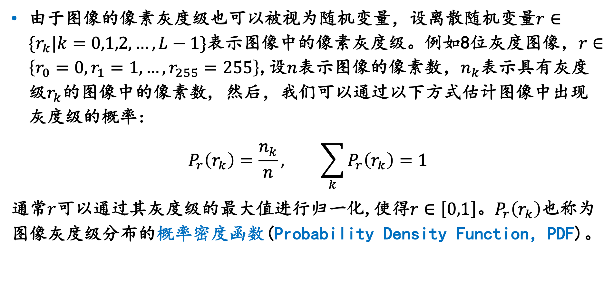

# 直方图处理

## 直方图概念

灰度级的直方图就是反映一幅图像中的灰度等级与出现这种灰度的概率之间的的关系图形，是图像重要的统计特征

## 直方图均衡化

是一种典型的通过对图像的直方图进行修正来获得图像增强效果的自动方法

把原始的直方图变换为均匀分布的直方图需要一个变化函数 $T$
$$
s=T(r)
$$

同时该函数满足两个条件

1. $T$ 函数是单调递增的
2. 对应 $0<=r<=L-1$ ,有 $0<=T(r)<=L-1$

根据统计学中的累积分布函数

### 直方图均衡化的流程

1. 统计得到原始的直方图
2. 计算累积直方图的各项
3. 归一化各个灰度等级的概率，并进行取整

### 直方图均衡化的缺点

经过均衡化直方图处理之后，图像的灰度等级是要减少的，这种现象叫做简并现象，之所以会造成简并现象，是因为在累积后进行归一化时的舍入或者取整操作，使用了近似的灰度等级来替代，于是就造成了一些损失

可以采用增加像素比特的方式来减缓这种现象，还可以采用灰度间隔放大理论的直方图来减少简并现象

## 直方图规定化

直方图均衡化处理方式是行之有效的增强方法，但是由于他的变化函数采用的是累积分布函数，他只能产生近似均匀的直方图的效果，这样必然会限制他的效能

有时需要构造特定的直方图，以便可以对图像中的某些灰度级加以增强，直方图规定化就是针对上述思想的提出的直方图增强方法

具体的就不多介绍了，下面这篇博客已经说明的很详细啦

[【数字图像处理】 直方图的均衡与规定化 - 司念 - 博客园 (cnblogs.com)](https://www.cnblogs.com/recoverableTi/p/13294497.html)