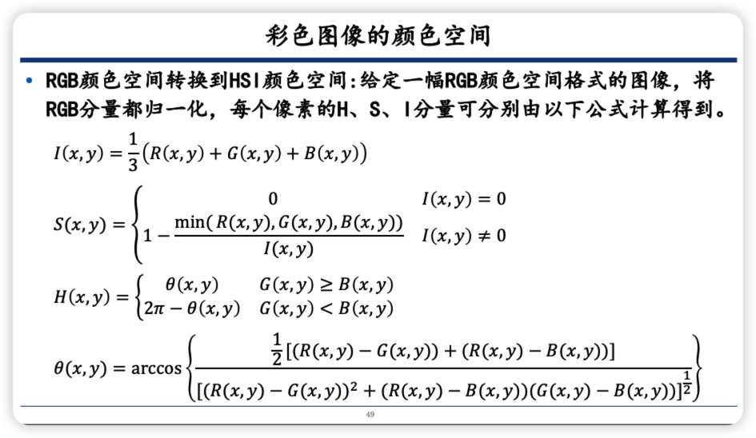

# 彩色图像

##  彩色基础

光具有波动性，不同颜色的光其实也就是波长不同，正常情况下，可见光的范围是 `400nm-700nm` 之间

我们可以看到不同颜色的物体，植物是绿色的，天空是蓝色的，那么我们之所以可以看到不同的颜色，其实是因为这些物体不吸收这种颜色的光，从而可以反射到我们的眼睛里面

为什么三原色是红绿蓝呢？主要是因为，研究发现，人体眼睛中的感光锥状细胞对红、绿、蓝的吸收是波长的函数，具有一定的规律

同时我们也知道，不同的颜色都是使用三原色混合得到的，也的确是这样的。但是也仅仅是对于光颜色。

在印刷领域，我们的颜料颜色一般使用 品红、青、黄相减产生二次颜色，如下图所示

本来我们描述颜色的参数化空间应该是三维的，但是颜色经常分为两个部分来类比：明度和色度

> 白色和灰色的色度是一样的，但是明度是不一样

各个参数的计算和表示如图所示

每一种颜色并不是只有一种合成方式，相当于，过坐标系上的一点不仅仅有一条直线

我们应该还经常听到一个词，叫做色域，顾名思义，色域就是颜色的区域。

> 色域：就是某种表色模式所能表达的颜色构成的范围区域

变色龙为什么会变色？

主要是因为变色龙的皮肤中有两层致密重叠的虹色细胞，这种细胞不含色素，含有无数的纳米晶体，变色龙通过皮肤的放松和张紧来控制这些晶体的排列结构，从而导致反射的光发生变化，从而实现体色的变化

## 彩色图像的颜色空间

### RGB

我们最经常使用的就是使用 RGB ，那就先来说说RGB

**像素深度** 

每个像素的比特数

那么使用 `24` 比特的RGB 彩色通道可以最多显示 `2` 的 `8` 次方的 `3` 次方

### 三基色模型

**RGB模型** 

首先就是 RGB模型：将将光谱线以各种不同的组合混合在一起可以产生加色

**彩色图像->灰度图像**

一张彩色图像中的每一个像素都需要三个元素来表示，分别对应 三个不同的颜色。

 

**彩色滤波器** 

其实这个就是我们手机里面常说的 CMOS 传感器，什么索尼的 IMX700，三星的 HM2啦

**拜尔阵列** 

**像素的合成**

### CMY 和CMYK 彩色空间

CMY 是一种减法模型，一般用于印刷领域

### HSI 颜色空间

**http://color.lukas-stratmann.com/color-systems/hsl.html**

> 这个网站不错，可以去模拟一下看看各种不同的颜色以及不同的分量所表示的含义

HSI、HSV、HSL、HSB是非常相似的

HSI 也就是指颜色的色相、饱和度、亮度

**色相H** 描述的一种纯色的颜色属性

**饱和度S** 度量纯色被白光系数的程度

**亮度I** 主观描述子，实际不可度量，体现了无色的强度概念

> 上面对亮度的描绘有点抽象哈

可以去上面那个网站，模拟一下就大概明白了

**RGB颜色空间到HSI颜色空间的转化** 

**HSI到RGB的转化** 

### RGB的色差

出现上述情况的原因窨已经说了，主要是人类感知的颜色差异和 RGB 空间中的颜色之间的距离是不一致的。

人类对绿色的感知是不太明显的，图中所示的圈圈明显就很大

### CIE Lab颜色空间

### CIE Lab 的缺点

### 颜色的作用

1. 目标识别

2. 人脸属性识别

3. 情感计算

## 伪彩色处理

## 全彩色处理

### 彩色变换

### 平滑和锐化、噪声

## 基于彩色的图像分割

