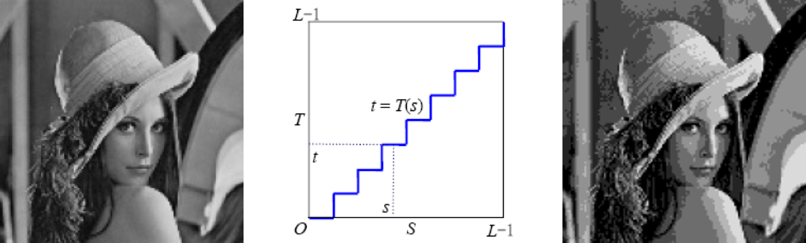

# 第三章 空间滤波

## 一、基本的灰度变换函数

对于灰度变换，或者灰度增强，主要的价值应该体现在机器对图像的使用上。一般来说，可以对单个像素点进行增强，也可以某个像素点的领域上

**灰度映射原理**

其实就是定义某种函数关系，把原来的像素灰度映射到新的像素灰度上，最终获得想要的效果

**例子**

$$
s=cr^{\gamma}
$$

> 注意中间蓝天白云的地方

**分段线性阶梯变化** 

## 二、空间滤波基础

### 2.1 基本概念

空间滤波通常将每个像素的值替换为像素或者邻居的值来修改图像。如果对图像像素执行的操作是线性的，则该滤波器被称为线性滤波器，否则就是非线性滤波器

空间滤波主要包含平滑处理和锐化处理两大类

**平滑处理** 

主要用于去除图像中一些不重要的细节并减小噪声

**锐化处理** 

锐化处理主要用于突出图像中的细节，增强图像边缘

**线性空间滤波器**

线性空间滤波器在图像和滤波之间执行乘积和运算，内核是一个数组，其大小定义了操作的领域，其系数决定了滤波器的性质

**均值滤波器**

均值滤波器求解的是模板内像素灰度值的平均值，是一个典型的线性滤波器

**统计排序滤波器**

统计排序滤波器是通过比较给定领域内的 **灰度值** 实现的，原始数据和滤波结果是一种逻辑关系，如最大值滤波，最小值滤波，中值滤波器等，都属于非线性滤波

### 2.2 **边缘填充**

**边缘填充**

$I$输入图像尺寸，$ F $模板尺寸，$P_{start} $ 左上部填充，$P_{end}$ 右下部填充,$O$输出图像尺寸,$S$ 步长。

**无填充**

输出尺寸 < 输入尺寸

**使用常数垫层图像**

* 保证图像不收缩，但是会在边缘产生梯度
* Zero-Padding

**最大填充** 

就是填充之后，保证输出图像的四个顶角是等于原图像的

**复制填充** 

就是被填充的像素值来自边缘像素值的复制

**反射填充**

和复制填充有点类似，但是被填充的像素值不来自于相邻的原图边缘，而是来自对面的

**模版的参数是否可以学习？**

> 卷积神经网络就是干这个的，不同的参数，对不同的特征敏感度不同

### 2.3 可分离滤波

所谓的可分离滤波就是，最初的滤波核是一个框框，在数学上是一个矩阵，但是呢，有些滤波核可以转换为一个列向量和行向量相乘的形式，一般来说，要求滤波核的秩为1。

那么就可以先进行一行一行的滤波，再进行一列一列的滤波。

## 三、 平滑处理

前面已经提到过，平滑处理常用于，模糊处理和降低噪声。平滑滤波器使用特定领域内像素的平均值或者逻辑值代替原始图像中的像素值，这种处理降低了图像灰度的急剧变化。然而图像边缘也是由图像灰度急剧变化带来的特性，因此平滑空间滤波器有边缘模糊化的负面影响

一般来说，平滑空间滤波器可分为平滑线性空间滤波器和平滑非线性空间滤波器

### 3.1 平滑线性空间滤波

平滑线性空间滤波器的输出四领域内的像素灰度值的简单平均值或者加权平均值。平滑线性空间滤波器有时也被称为均值滤波器

均值滤波器的一个重要的特性就是降低图像中的噪声。另一个重要应用是去除图像中的不相关的细节，使不相关的细节与背景柔和在一起，此时模版的大小与不相关细节的尺寸有关

### 3.2 盒状滤波

代码：**https://tianchi.aliyun.com/notebook-ai/detail?postId=255679**

> 随着滤波模版的增大，远处的风景模糊化的同时，也将摄影师模糊化了

**盒状滤波的缺点** 

* 散焦透镜通常被建模为低通滤波，但是盒装滤波对透镜的模糊特性的近似型较差

* 另一个限制是盒装滤波器强调沿水平方向模糊，在设计具有高细节水平或具有强几何分量的图像中的应用，盒状滤波器的方向性通常会导致负面影响

**均值滤波器**

常用的均值滤波器是加权平均的，即在计算滤波器响应时，领域中某些像素的权重较大。

> 如图所示的加权平均滤波器模板，模板中心位置的系数最大，模板其他位置的系数与距离模板中心的距离成反比。用户可根据实际目标调整加权平均滤波器模板各系数的权重

### 3.3 高斯滤波

**如果想让中心像素具有最大的影响应该怎么做？**

如果使用盒状滤波器，那就是把最中间的权重置为最高啦

但是还有更好的办法

一说到高斯滤波，可能经常会听到一个词，叫做高斯模糊，其实两个说的差不多，但是不能划等号

### 3.4 统计排序

统计排序滤波器是典型的非线性平滑滤波器，首先对模板所覆盖的像素的灰度值进行排序，选择有代表性的灰度值作为统计排序滤波器的响应

**中值滤波器**

中值滤波器是用像素领域内的中间值代替该像素，主要用于降噪。

在统计排序滤波器中，中值滤波器的应用最广。对于一定类型的随机噪声中，中值滤波器的降噪效果是较好的，同时比相同尺寸的均值滤波器模糊程度明显要低。中值滤波器对处理脉冲噪声非常有效，因为中值滤波器取中值作为滤波结果，可以很好的去处滤波器所覆盖领域中的一些黑点或者白点

**最大值滤波器**

最大值滤波器使用像素领域内的最大值代替像素值，主要用于寻找最亮点。可以有效降低盐粒噪声

**最小值滤波器**

最小值滤波器是用像素领域内的最小值代替该像素值，主要用于寻找最暗点，可以有效降低胡椒噪声

### 3.5 拉普拉斯变换

### 3.6 sobel 变化

## 四、锐化处理

锐化处理的目的是增强图像中的细节，边缘、轮廓和其他灰度不连续性， 并弱化强度变化缓慢的区域。

注意，锐化算子的响应强度与应用该算子的点处的强度不连续性的大小成比例

由于导数是对函数局部性变化率的一种描述，因此图像锐化算法的实现可基于空间导数。

图像平滑处理会对边缘和细节产生模糊的负面效果，图像平滑和图像锐化在逻辑上是相反的操作，因此可以使用原始图像减去平滑处理后的图像来实现锐化处理，称为反锐化掩蔽

### 4.1 一阶导数算子

**条件** 

* 在恒定灰度区域必须为 0
* 在灰度阶跃或者渐变开始时必须为非零
* 沿灰度渐变必须为非零

> 但是由于在图像处理中处理的是离散的情况，数字函数的导数由差分来近似。因此，一维函数的一阶导数的定义是差分

$$
\frac{df}{dx}=\frac{f(x+\Delta)-f(x)}{\Delta}
$$

转换成图像中的表示就是 
$$
f(x+1)-f(x) 
$$

$$
f(x)-f(x-1)
$$

对于二维的图像

#### 罗伯特交叉梯度算子

罗伯特提出边缘检测器应该具有以下特性

* 产生的边缘应清晰
* 背景应尽可能减少噪音
* 边缘灰度应该尽可能接近人类的感知

罗伯特提出两个交叉差分来表示 $g_{x}$ 和 $g_{y}$
$$
g_{x}=z_{9}-z_{5}
$$

$$
g_{y}=z_{8}-z_{6}
$$

梯度的大小可以重写为
$$
M(x,y)=\sqrt{g_{x}^{2}+g_{y}^{2}}
$$

罗伯特所提出的两个交叉差分算子，也被称为罗伯特交叉梯度算子

代码：**https://tianchi.aliyun.com/notebook-ai/detail?postId=255824**

Robert 算子更详细的解释 [Roberts 算子、 Prewitt 算子、 Sobel 算子和 Laplacian 算子边缘检测技术 - 极客挖掘机 - 博客园 (cnblogs.com)](https://www.cnblogs.com/babycomeon/p/13206130.html)

#### 对图像锐化

使用罗伯特交叉算子处理图像可以得到 梯度图像 $M(x,y)$

那如何对图像进行锐化呢？
$$
g(x,y)=f(x,y)+cM(x,y)
$$
可以将梯度图像以一定的比例叠加到原图像，其中 $c$  为锐化强度系数

#### 索伯算子

> 由于奇数大小模版具有对称中心，比偶数模板更容易实现，索伯提出了 $Sobel$ 算子

代码 **https://tianchi.aliyun.com/notebook-ai/detail?postId=255826**

### 4.2 二阶导数算子

二阶导数算子，首先二阶导数就是导数的导数，二阶导数算子满足以下的条件

* 灰度不变的区域导数为零
* 在灰度阶跃或者斜坡的起点处导数值非零
* 沿着斜坡的导数为零

关于拉普拉斯算子更加详细的介绍参考

[拉普拉斯算子]([Python 图像处理 OpenCV （12）： Roberts 算子、 Prewitt 算子、 Sobel 算子和 Laplacian 算子边缘检测技术 - 极客挖掘机 - 博客园 (cnblogs.com)](https://www.cnblogs.com/babycomeon/p/13206130.html))

代码 **https://tianchi.aliyun.com/notebook-ai/detail?postId=255852**

### 4.3 反锐化掩蔽

从原始图像中减去经过平滑处理后的版本是印刷业经常采用的方法

1. 首先通过平滑滤波得到模糊图像
2. 从原始图像中减去模糊图像得到差值图像
3. 最后将差值图像叠加到原始图像中

代码 **https://tianchi.aliyun.com/notebook-ai/detail?postId=255861**

## 五、混合空间增强

所谓的混合空间增强，就是综合利用平滑过滤器，锐化滤波器，灰度拉伸，对图像进行处理

在本案例中，首先使用拉普拉斯锐化方法突出图像中的小细节，然后使用**sobel** 梯度处理方法突出图像的边缘，并使用平滑的梯度图像用于掩蔽拉普拉斯锐化增强图像，最后使用灰度幂律变换来增强图像的灰度动态范围*

代码 **https://tianchi.aliyun.com/notebook-ai/detail?postId=255877**

数据集 **https://tianchi.aliyun.com/notebook-ai/detail?postId=255877**

### 5.1 复合空间滤波增强

### 5.2 多步空间滤波处理

 