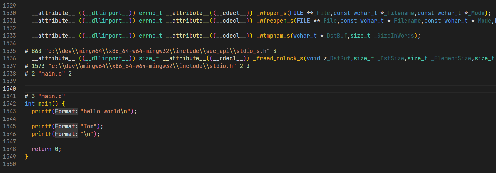
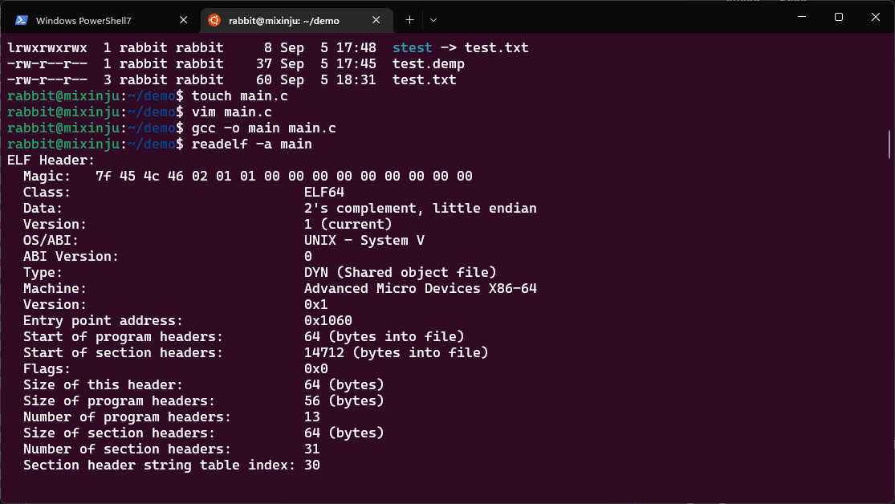
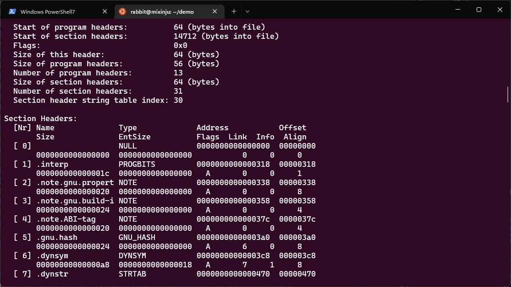
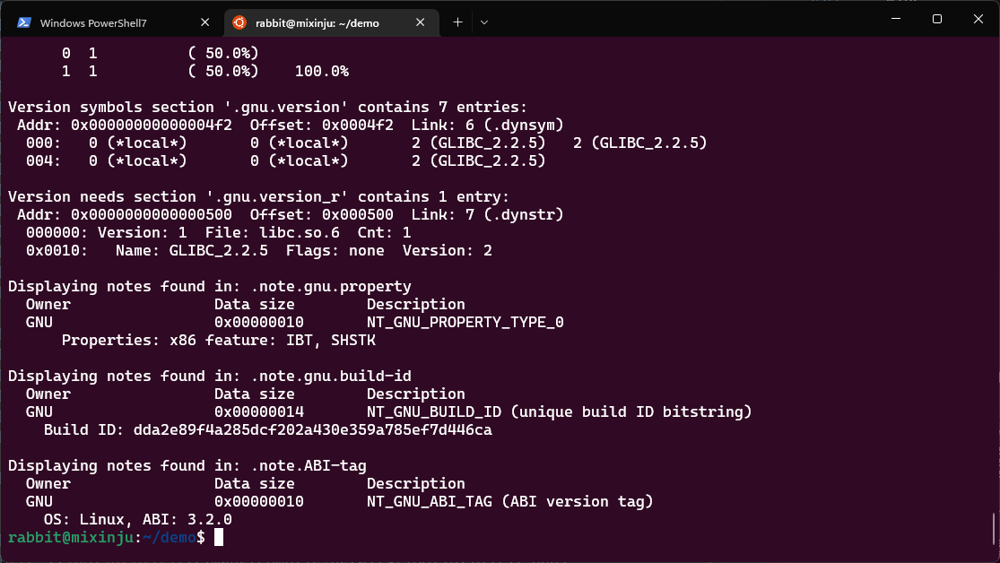
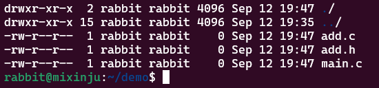
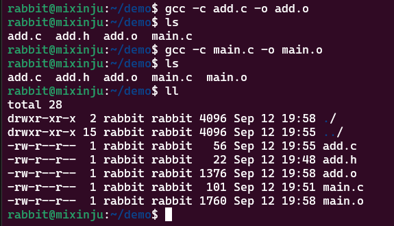
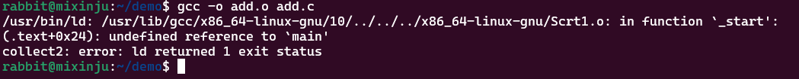
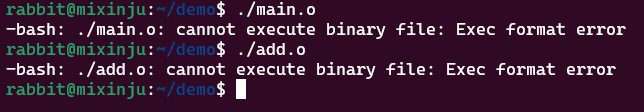
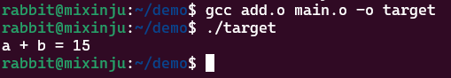

## 编译过程
### 文件格式

|后缀名|	描述|
|:-:|:-:|
|.a	|打包目标文件的库文件|
|.c/.C/.cc/.cp/.cpp/.cxx/.c++|	源代码文件，函数和变量的定义/实现|
|.h/.hpp/.h++	|头文件，函数和变量的声明|
|.ii	|编译预处理产生的文件|
|.o (.obj in Windows)	|编译产生的中间目标文件|
|.s	|编译产生的汇编语言文件|
|.so	|编译产生的动态库文件|
|.out (.exe in Windows)|	链接目标文件产生的可执行文件|

___

我们使用下面的两个代码片段来说明

```c
#include <stdio.h>
#define NAME "Tom"
int main() {
  printf("hello world\n");

  printf(NAME);
  printf("\n");

  return 0;
}
```

___

```c
int main() {

  int a = 0, b = 0;
  int c = a + b;

  return 0;
}
```
> 第二个代码不会在预处理的时候包含大量的 `<stdio.h>` 里面代码。可以更加直观

### 预处理
所谓预处理也就是把一些宏定义进行替换、头文件包含进来。同时，去掉注释，给代码添加行号
主要包含以下几点
1. 读取C/C++源程序，对其中的伪指令（以#开头的指令）进行处理
2. 删除所有的注释//(可能这就是注释之所以被称为注释的原因吧)
3. 添加行号和文件名标识。
4. 保留所有的 [#pragma](https://www.jianshu.com/p/b019a3ca1c71) 编译器指令

使用一下命令即可生成预处理之后的文件
> `gcc -E main.c -o main.ii`

* 第一个代码片段预处理结果
> 包含的 `<stdio.h>` 文件太长，这里给一个截图



* 第二个代码片段
```c
# 0 "main.c"
# 0 "<built-in>"
# 0 "<command-line>"
# 1 "main.c"
int main() {

  int a = 0, b = 0;
  int c = a + b;

  return 0;
}

```
### 编译
这个编译是指把预处理后的文件编译为汇编代码（main.ii -> main.s）

> 将预处理完的文件进行一系列词法分析、语法分析、语义分析及优化后，产生相应的汇编代码文件。

* 命令
> `g++ -S main.ii -o main.s`
> 或者也可以直接由mian.cpp来生成main.s
* 第一个代码片段编译后
```x86asm
	.file	"main.c"
	.text
	.def	__main;	.scl	2;	.type	32;	.endef
	.section .rdata,"dr"
.LC0:
	.ascii "hello world\0"
.LC1:
	.ascii "Tom\0"
	.text
	.globl	main
	.def	main;	.scl	2;	.type	32;	.endef
	.seh_proc	main
main:
	pushq	%rbp
	.seh_pushreg	%rbp
	movq	%rsp, %rbp
	.seh_setframe	%rbp, 0
	subq	$32, %rsp
	.seh_stackalloc	32
	.seh_endprologue
	call	__main
	leaq	.LC0(%rip), %rax
	movq	%rax, %rcx
	call	puts
	leaq	.LC1(%rip), %rax
	movq	%rax, %rcx
	call	printf
	movl	$10, %ecx
	call	putchar
	movl	$0, %eax
	addq	$32, %rsp
	popq	%rbp
	ret
	.seh_endproc
	.ident	"GCC: (MinGW-W64 x86_64-ucrt-posix-seh, built by Brecht Sanders) 12.2.0"
	.def	puts;	.scl	2;	.type	32;	.endef
	.def	printf;	.scl	2;	.type	32;	.endef
	.def	putchar;	.scl	2;	.type	32;	.endef

```
* 第二个代码片段编译后
```x86asm
	.file	"hello.c"
	.text
	.def	__main;	.scl	2;	.type	32;	.endef
	.globl	main
	.def	main;	.scl	2;	.type	32;	.endef
	.seh_proc	main
main:
	pushq	%rbp
	.seh_pushreg	%rbp
	movq	%rsp, %rbp
	.seh_setframe	%rbp, 0
	subq	$48, %rsp
	.seh_stackalloc	48
	.seh_endprologue
	call	__main
	movl	$0, -4(%rbp)
	movl	$0, -8(%rbp)
	movl	-4(%rbp), %edx
	movl	-8(%rbp), %eax
	addl	%edx, %eax
	movl	%eax, -12(%rbp)
	movl	$0, %eax
	addq	$48, %rsp
	popq	%rbp
	ret
	.seh_endproc
	.ident	"GCC: (MinGW-W64 x86_64-ucrt-posix-seh, built by Brecht Sanders) 12.2.0"


```

### 汇编
将编译完的汇编代码文件翻译成机器指令，并生成可重定位目标程序的.o文件，该文件为二进制文件，字节编码是机器指令。
> Linux 上生成的是ELF 文件，即可链接可执行文件。想我们上面的代码，不需要其他任何 "依赖",y也被称为完全链接的，我们看在 `Linux` 上是怎么的。因为是二进制文件，所以我们使用 `readelf` 命令才查看









> 关于 `ELF` 文件还有很多可以深究的地方，同时也是大厂面试可能会深挖的知识点，还会搭配链接，包括静态链接和动态链接

### 链接
过链接器将一个个目标文件（或许还会有库文件）链接在一起生成一个完整的可执行程序
在这里我们不再使用以上代码，代码文件如下



* add.h
```c
int add(int a,int b);
```

* add.c
```c
#include "add.h"
int add(int a,int b){
    return a+b;
}
```
* main.c
```c
#include<stdio.h>
#include "add.h"
int main(){
    printf("a + b = %d\n",add(7,8));

    return 0;
}
```

使用命令行生成对应的 `.o`文件



> 注意一定要加 `-c` 选项，表明只执行预处理，编译和汇编，即生成可链接可执行文件 (`Linux` 是 `.o` 后缀，`Windows` 平台是 `obj`后缀)

错误示范


---
经过以上步骤，终于得到了我们的两个 `add.o` 和 `main.o` 可链接可执行
文件。

如果我们这个时候单独运行 `main.o` 会怎么样？




我们执行链接后生成最终的可执行文件



----

以上就是编译的大概过程了，如有错误，还请指正

## gcc/g++ 常用参数
> 更新中...
[基本指令](https://www.runoob.com/w3cnote/gcc-parameter-detail.html)

## 参考博文

https://www.jinhang.work/tech/cpp-building-process/

https://blog.csdn.net/wcc27857285/article/details/84945519

https://www.jianshu.com/p/b019a3ca1c71

