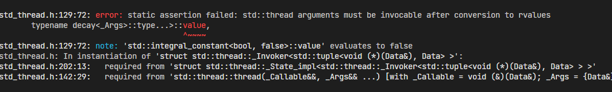
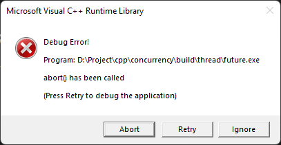

# 并发编程初探
本节内容主要是C++ 并发编程初步探讨
## 开启一个线程

首先来看并发编程的第一个例子
### 方式一
```cpp
#include <iostream>
#include <thread>

void concurrencyFunc(int a, int b) {
  std::cout << "a is " << std::endl;
  std::cout << "b is " << std::endl;
  std::cout << "a + b is :" << a + b << std::endl;
}
int main() {
  std::cout << "First concurrency program\n";
  std::thread t(concurrencyFunc, 9, 6);

  // 如果运行报错，添加以下语句
  // 详见下一节 [管控线程]
  //t.join();

  return 0;
}
```
因为 `C++11` 自带了 `std::thread` 所以完全可以舍弃 `C` 风格的那一套 (`pthread`)啦。
在以上代码中，我们定义了一个 函数(可执行单元的形式之一)，在 ` main()` 里面创建了一个 `std::thread` 对象 (`object`) 。同时传入一个 **可调用对象**(`callable object`),除此之外，在后面传递这个可调用对象的参数。那么系统就会发起一个线程去单独执行我们的  `concurrencyFunc()`；  

**这样和直接在 `main()` 函数里面调用**有什么区别？

区别就是 `concurrencyFunc()` 是单独一个线程去执行的，直接调用的话就是在 `main()` 执行线程里面和其他单元串行执行。

### 方式二
> 使用 `lambda` 表达式

`lambda` 表达式是 `C++11` 新的特性，具体的这里不过多介绍。但是在这里，一个 `lambda` 表达式就是一个可执行单元。
```cpp
#include <iostream>
#include <thread>

int main() {
  std::cout << "First concurrency program\n";
  std::thread t(
      [](int a, int b) {
        std::cout << "Hello lambda\n";
        std::cout << "a + b is:" << a + b << std::endl;
      },
      3, 11);

  // 如果运行报错，添加以下语句
  t.join();

  return 0;
}
```
以上就是使用  `lambda` 开启一个线程的方法，参数也是放到后面传递给实际执行的可调用单元

同时我们还可以在 `lambda` 里面再次调用一个函数或者其他的执行单元

```cpp
#include <cmath>
#include <iostream>
#include <thread>

int main() {
  std::cout << "First concurrency program\n";
  std::thread t(
      [](int a, int b) {
        std::cout << "Hello lambda\n";
        std::cout << "a ^ b is:" << pow(a, b) << std::endl;
      },
      3, 11);

  // 如果运行报错，添加以下语句
  t.join();

  return 0;
}
````


## 管控线程
###  `join()`
> `std::thread` 只是一个类而已，他的作用也仅仅是发起一个线程，让传递进来的可执行单元在新的线程上运行


上面代码中提到了一个 `std::thread` 的成员函数  `join()` 他的意思可以理解为主线程等待子线程结束，在我们的代码里面可以理解为是 `main()` 所运行的线程等待可执行单元所在的线程，一直到这个可执行单元执行完毕。

如果不等待的话并且在主线程结束子线程还未完成时， `std::thread()` 就会调用 `std::terminate()` 

可以在一下代码中尝试执行 `join()` 操作和不执行的结果

```cpp
#include <chrono>
#include <cmath>
#include <iostream>
#include <thread>
void concurencyFunc() {
  std::cout << "concurrencyFunc:\n start\n";

  //延迟两秒,暂时忽略即可
  std::this_thread::sleep_for(std::chrono::milliseconds(2000));

  std::cout << "end\n";
}
int main() {
  std::cout << "First concurrency program\n";

  std::thread t(concurencyFunc);

  // t.join();

  std::cout << "main thread end\n";

  return 0;
}
```
### `detach()`
`std::thread` 中的成员函数 `detach()` 是显示的分离一个  `std::thread` 对象和一个线程，让其在后台执行。并且 `std::thread` 对象在销毁时，也就是 `main()` 运行结束时，要清理资源，并不会调用 `std::terminate()` 但是这个线程的归属权和控制权都转移给 `C++ Runtime`.

以上代码如果使用  `detach()` 的话，最终的运行结果和不适用 `join()` 应该是一样的，但是程序会显示正常结束，而不是被 `std::terminate()` 中断而异常退出

<svg t="1662886891580" class="icon" viewBox="0 0 1024 1024" version="1.1" xmlns="http://www.w3.org/2000/svg" p-id="1376" width="16" height="16"><path d="M1001.661867 796.544c48.896 84.906667 7.68 157.013333-87.552 157.013333H110.781867c-97.834667 0-139.050667-69.504-90.112-157.013333l401.664-666.88c48.896-87.552 128.725333-87.552 177.664 0l401.664 666.88zM479.165867 296.533333v341.333334a32 32 0 1 0 64 0v-341.333334a32 32 0 1 0-64 0z m0 469.333334v42.666666a32 32 0 1 0 64 0v-42.666666a32 32 0 1 0-64 0z" fill="#FAAD14" p-id="1377"></path></svg>
一旦调用 `detach()` 函数，那么一个  `std::thread` 对象就和 线程分离啦，如果再次调用会引发异常。所以对于一个 `std::thread ` 对象来说，只有在确保其是 `joinable()` 时，才可以调用 `detach()`.同理对于 `join()` 来说也是一样的

```cpp
if (t.joinable()) {
    t.detach();
  }

  if (t.joinable()) {
    t.join();
  }
  ```
  ## 向线程函数传递参数

> 向一个线程函数或者说在一个线程里面被调用的可执行单元传递参数，存在一个问题就是是值的拷贝还是引用,其实都不是的，严格来说是右值引用

<svg t="1662887365430" class="icon" viewBox="0 0 1024 1024" version="1.1" xmlns="http://www.w3.org/2000/svg" p-id="2349" width="16" height="16"><path d="M816.782031 265.847787c15.375821 36.07052 24.247235 70.074985 26.612195 102.009302 2.36803 31.934317 0.593543 61.3513-5.319369 88.256066-5.917005 26.909883-14.489601 51.004651-25.728021 72.297606-11.23535 21.287839-22.913811 39.916105-35.037428 55.880705-12.123617 15.9646-23.50633 29.123294-34.153255 39.47506-10.645901 10.347672-18.036529 17.293875-22.176999 20.840654-5.911888 5.323239-11.383736 9.317203-16.41145 11.975752-5.024644 2.664689-9.45984 4.882194-13.306609 6.652514-3.841653 1.77646-7.540037 3.846608-11.087988 6.211469-3.546928 2.364861-7.093856 6.206352-10.641808 11.529591-7.688422 11.234879-13.605427 22.176069-17.741804 32.822546-4.141494 10.641361-7.688422 20.993127-10.646925 31.046087-2.958502 8.277524-6.210706 15.07637-9.758657 20.399609-3.546928 5.323239-7.389604 10.05296-11.530075 14.193257-4.72992 4.729721-9.463933 8.575306-14.193853 11.529591L410.505255 790.967596c-4.72992-2.954285-9.166138-6.798846-13.305586-11.529591-4.140471-4.140297-8.277871-9.463536-12.418342-15.9646-4.141494-6.506181-7.688422-14.786775-10.646925-24.840758-5.911888-17.147542-13.158223-30.898731-21.729796-41.246403-8.576689-10.347672-19.665701-20.551058-33.264987-30.605042-9.464956-7.093559-20.25822-16.558118-32.381837-28.381397-12.123617-11.828396-24.095779-25.722848-35.925695-41.692564-11.828893-15.9646-23.065266-33.851992-33.706051-53.6632-10.646925-19.811208-19.22259-41.545208-25.728021-65.197908-6.50236-23.652699-10.34913-48.934502-11.531098-75.839269-1.181968-26.909883 1.476693-55.145971 7.982123-84.715427 10.053382-47.305399 27.500462-87.074148 52.337146-119.302153 24.839754-32.229029 52.633917-58.104349 83.387605-77.615729 30.748572-19.516496 62.535843-33.56342 95.359767-42.133609 32.817784-8.576329 62.535843-12.863982 89.148038-12.863982 27.794163 0 56.771317 3.841491 86.931464 11.529591 30.163216 7.688099 59.287733 19.664875 87.37662 35.928281 28.094004 16.259312 53.817932 36.95875 77.176899 62.092174C782.926571 200.057385 801.997705 230.366691 816.782031 265.847787zM624.290056 845.966211l0 9.758248c0 2.954285 0.147362 6.206352 0.441063 9.758248 0.294725 3.546779 0.447204 7.093559 0.447204 10.641361-0.594566 11.234879-3.699407 23.505343-9.317594 36.810371-5.617163 13.30605-16.410427 22.916942-32.37672 28.828582-6.505431 2.369977-14.930664 5.770424-25.282864 10.205433-10.348107 4.435009-25.87129 6.652514-46.571596 6.652514-17.741804 0-32.37672-2.071172-43.906795-6.211469-11.535192-4.140297-20.552944-6.79987-27.059398-7.981788-8.277871-1.77646-14.930664-5.470595-19.959402-11.087523-5.024644-5.617951-8.87039-11.975752-11.530075-19.070334-2.663778-7.099698-4.287833-14.341636-4.881375-21.735024-0.589449-7.393387-0.884174-14.045901-0.884174-19.958564l0-27.499307L624.290056 845.966211z" p-id="2350" fill="#f4ea29"></path></svg>
线程具有内部空间，参数会按照默认方式先复制到该处。新创建的执行线程才可以访问他们，然后这些副本被当成临时变量，以右值形式传递给新线程上的函数或者可执行单元。

```cpp
#include <chrono>
#include <cmath>
#include <iostream>
#include <thread>
class Data {
public:
  int num_;
  Data() { std::cout << "this is default constructor\n"; };
  Data(const Data &d) {
    std::cout << "this is copy constructor\n" << std::endl;
  }
  Data(const Data &&d) = delete;
};

void concurencyFunc(Data &d) {
  std::cout << "concurrencyFunc:\n start\n";

  // 延迟两秒,暂时忽略即可
  std::this_thread::sleep_for(std::chrono::milliseconds(2000));

  std::cout << "end\n";
}
int main() {
  std::cout << "First concurrency program\n";

  Data d;
  std::thread t(concurencyFunc, d);

  if (t.joinable()) {
    t.join();
  }

  std::cout << "main thread end\n";

  return 0;
}

```


以上问题主要在于最终传递的是一个右值引用，但是我们的形参确实一个左值引用。
### 解决方案一
更改形参类型
> 一种是直接更改这个函数的形参类型为右值引用，只存在一个形参是右值引用额函数，另外一种是重载此函数，定义额外的使用右值引用的版本

```cpp
void concurencyFunc(Data &&d); 
```
### 解决方案二
使用 `std::ref()` 显式的传递一个引用

```cpp
std::thread t(concurencyFunc, std::ref(d));
``` 

## 移交线程的归属权
>每一个 `std::thread` 对象都关联着一个线程, 在有些情况下，我们需要在不同的 `std::thread` 对象中转移这些线程。

对于 `C++` 来说，存在这一些只可以复制不可以移动的类型，比如 `std::unique_ptr<>` 那么 `std::thread` 也是不可复制，只可以移动的，所以，在进行归属权转移的时候需要使用 `std::move()` 来执行移动语义。

```cpp

#include <algorithm>
#include <chrono>
#include <cmath>
#include <functional>
#include <iostream>
#include <stdlib.h>
#include <thread>
int func1() {
  std::cout << "func\n";

  return rand();
}

int func2() {
  std::cout << "func2\n";

  return rand();
}

int func3() {
  std::cout << "func3\n";

  return rand();
}

int main() {
  std::thread t1(func1);

  std::thread t2(func2);

  std::thread t3 = std::move(t2);

  t1 = std::move(t3); // std::terminate() 被调用

  t1.join();
  t2.join();

  return 0;
}
```
以上就是不同 `std::thread` 对象之间的转移，但是有一点需要注意的就是

`t1 = std::move(t3); // std::terminate() 被调用`
 
 这一行代码会因为 `t1` 已经关联了一个正在运行的线程，如果这个时候把 `t3` 关联的线程转移给他，他就会调用 `std::terminate()` 
 
 


## 其他
### 获取硬件所支持的并发数
可以使用 ` std::thread::hardware_concurrency()` 来获取可以真正并发的数量，对于目前的多核 `CPU` 来说，一般是其物理核心数。
### 识别线程
使用 `std::this_thread::get_id()` 来获取一个线程为识别特征，其返回类型是 `std::thread::id`类型

```cpp
#include <iostream>
#include <thread>
int main() {

  std::cout << std::thread::hardware_concurrency() << std::endl;
  std::thread::id id = std::this_thread::get_id();
  std::cout << id << std::endl;

  return 0;
}
```


