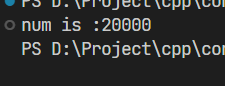

# 在线程间共享数据
> 假如你和朋友合租公寓，公寓只有一个厨房和一个浴室。一般情况下，两个人不会共同使用厨房和浴室，此外假如其中一个人占据浴室，而另外一个也恰好需要，那么就会感到不方便
----

本节主要结束如何在 `C++` 的多线程间共享数据，避开潜在问题，发挥最大的作用


## 线程间共享数据的问题
线程之间共享数据的问题多由数据改动引发。如果所有数据都是只读数据，一般情况下，就不会有问题。

举一个例子，一个数据，假如两个线程都要对这个变量执行递增操作，我们理想的情况是执行完毕后变量的值应该实际递增了 `2` .但是实际运行的情况可能不是那么理想，比如，两个线程同时看到变量，并且保存在对应处理器核心的寄存器里面，执行 `+1` 操作，然后写回，那么问题就来了，我们认为最后应该 `+2` 的结果，但实际是 `+1` .因为两个线程同时读取，那么写回的时候就相当于执行了一次递增.

```cpp
#include <iostream>
#include <thread>

int num = 0;

void increase() {
  for (int i = 0; i < 10000; i++) {
    num += 1;
  }
}

int main() {

  std::thread t1(increase);
  std::thread t2(increase);

  t1.join();
  t2.join();

  std::cout << "num is :" << num << std::endl;

  return 0;
}
```
以上代码理论上应该输出 `20000` ，但是实际输出一定是小于 `20000` 的。

以上只是说明其中一种情况，术语应该叫做 **数据竞争**
属于特殊特条件竞争，那么什么是条件竞争呢？

> 在并发编程中，操作由两个或多个线程负责，他们争先让线程执行各自的操作，而结果取决于它们的相对顺序

## 利用互斥保护共享数据
### `std::mutex`
对于我们最初举的例子，如果想让多个线程正常的读取，或者叫理想的读取，就要求不同线程之间的读取时互斥的，在`C++` 中可以使用  `std::mutex` 互斥量

使用互斥之后的代码如下
```cpp
#include <iostream>
#include <mutex>
#include <thread>

int num = 0;
std::mutex mu;
void increase() {
  for (int i = 0; i < 10000; i++) {
    mu.lock();
    num += 1;
    mu.unlock();
  }
}

int main() {

  std::thread t1(increase);
  std::thread t2(increase);

  t1.join();
  t2.join();

  std::cout << "num is :" << num << std::endl;

  return 0;
}
```
最终运行结果如下



是不是一个简单的互斥就可以搞定一切了呢？

答案肯定不是，仅仅使用一个最基本的互斥的话,可能会产生一些问题，比如其中一个线程运行中抛出异常，导致互斥未解锁( 调用 `unlock()` 成员函数)，那就会导致另外一个线程一直在等待互斥。

所以 `C++` 还提供了一个模板类 `std::lock_guard<>` 此模板类采用 `RAII` 原则，(即，资源获取即初始化),更详细请自行学习。
从而保证，在构造的时候对传进来的互斥上锁，析构的时候对互斥解锁。上锁和解锁的动作自然发生，不需要程序员手动去管理这个互斥，极大的避免了我们说的哪一种情况


### `std:: lock_guard<>`

上面已经说了不少，这里再补充一下， `C++17` 新增了类模板推导，也就是说我们可以不用传递模板类型参数，可以直接在其构造函数里面传入互斥即可

```cpp
void increase() {
  for (int i = 0; i < 10000; i++) {
    std::lock_guard<std::mutex> guard(mu);
    // std::lock_guard guard(mu); // 编译器需支持C++17
    num += 1;
  }
}
```
### 组织和编排代码以保护贡献数据

虽然上述工具已经解决了大部分问题，但是


## 利用其他工具保护共享数据
