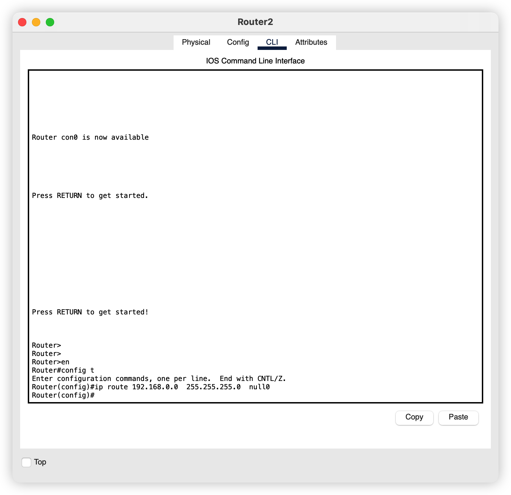

# 网络聚合错误导致的路由环路问题


## 引言

路由聚合就是把可以通过和自己相连的到达多个其他网络的路由按照最长公共前缀合并成一个。这样就可以减少路由匹配的比较次数，快速到达对应的网络

## 网络拓扑


给各个网络设备配上对应的网络

目前的路由是，可以从最右边的设备到达左边的两台设备，但是左边的不可以到达右边的，这是因为我们只给路由3 配置了一个路由，这个路由可以让右边的数据报到达左边。但是左边的数据报因为没有对应的路由信息，所以就不能达到。


## 存在的问题

上面的路由配置好像是没有什么问题的，最多就是左边的不可以给右边的通信，但是实际上存在一个环路的问题。

路由器3 的聚合路由包含了一下四个 IP 地址

```bash
192.168.0.0/24  不存在
192.168.1.0/24  存在
192.168.2.0/24  存在
192.168.3.0/24  不存在
```

还有就是路由2 的默认路由是的下一跳是路由3.所以存在的问题就是：

**如果右边主机发送一个消息到一个不存在的IP，比如 `192.168.3.0/24` 由于路由3的聚合路由的作用，这个数据报会被转发到路由2，但是路由2会把这个路由匹配到默认路由，也就是转发给路由3，那么这个时候就陷入了无尽的循环了**

> 但是由于 TTL 字段的存在，不会让这个报文一直循环交付，但是依旧会占用网络资源


我们可以通过查看数据报内容，发现TTL 字段已经减少了，接下来就是这个报文不断的在路由2和路由3之间交换，直到TTL 字段减小到0

## 解决方案

创建黑洞路由

在路由2上创建一个路由

```bash
192.168.0.0/24   null0
```

```bash
Router>enable
Router#config t
Enter configuration commands, one per line.  End with CNTL/Z.
Router(config)#ip route 192.168.0.0  255.255.255.0  null0
```

即可配置



## 最后尝试

这个时候，我们再来发送数据


路由器2发现这个路由匹配 `null0` 那就直接丢弃

