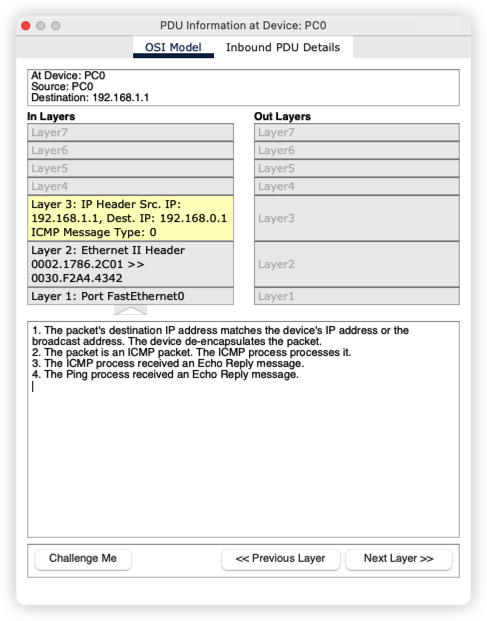
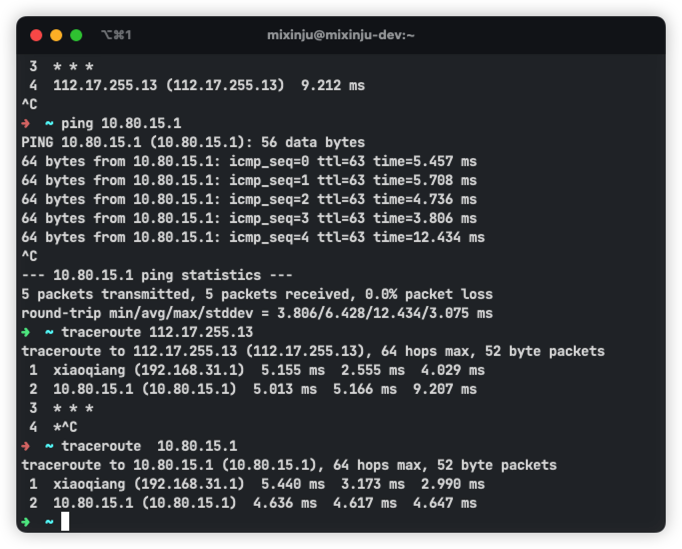

# 网际控制报文协议 ICMP 的应用举例

## 引言

ICMP 说起可能比较陌生，但是 `ping` 命令应该是比较熟悉的啦。那么还有一个是 `traceroute` 命令，这个是用来追踪链路的

我们现在电脑上对 `baidu.com` 做个测试

 

接下来试试 `traceroute`

 

## 网络拓扑

为了足够展示这两个命令，链路稍微长了一些

> 上面的两台主机是要配置静态路由的，否则不通的，同时两台主机的默认网关也是要手动配置的

## `ping` 命令演示

调整思科模拟器为仿真模式，然后在一台主机的命令行窗口发送 `ping` 命令

当这个报文到达目的主机之后，目的主机会发送回应报文

同时我们还应该注意到，这个ICMP 报文类型也从 `8` 变成了 `0`

当发送 `ping` 报文的 主机收到数据之后逐层的解析，发现这是一个 `ping` 报文

## `traceroute` 命令

这个命令不知道为啥没法用，换成 `tracert` 也是没法用

上面就是用真机演示了一下

