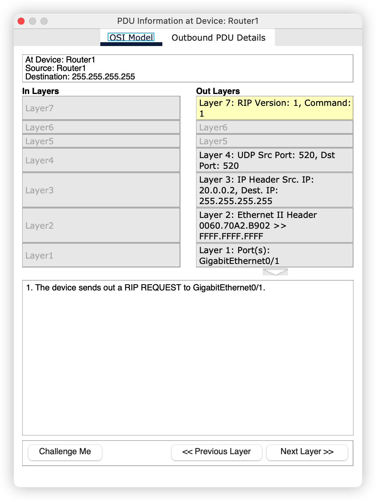

# RIP 协议

## 引言

 `RIP ` 协议也就是路由信息协议

## 网络拓扑

 

## 配置连线

这次的连线稍微有点特殊啦，单独说一下吧

首先要先关闭电源，然后拖动对应的物理插槽到对应的安装位置

三个路由的物理插槽都安装好之后，开始连线，这个时候不能使用快速连线了，应该使用

## 配置IP地址

虽然已经配置好了  IP 地址，但是目前两台主机还是不能通信的，因为没有配置路由。

## 启动 RIP 协议

切换到仿真模式，事件过滤器中仅仅开启 `ICMP` 和 `RIP` 协议

接下来就启动 `RIP` 协议

这个时候，路由器发送一个请求

这个请求是一个广播请求

给三台路由器都配置上 RIP 协议

 之后，我们使用查看按钮来查看一下路由器的路由表

其中 `R` 开头的就是表示是 `RIP` 协议学习来的路由

## 发送报文

