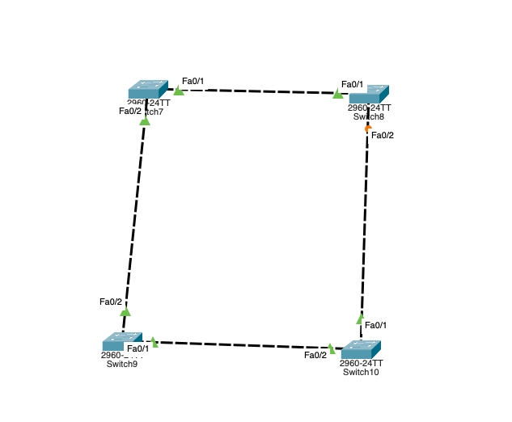

# 生成树协议STP

## 引言

这里不去具体的阐述生成树协议的具体，主要说明一下生成树协议的一些作用，其实就是主要为了避免环路产生的，如果在一个网络中，产生的环路，那么就会有数据报源源不断的在整个环路里面发送，占用大量的资源，会导致真正有效的数据无法发送

## 网络拓扑



> 创建四台交换机，相互连线，之后不断切换实时模式和仿真模式，让连线之间的橙色状态变为绿色，最终，应该得到的是四台交换机是处于联通状态的，但是右边的这条链路并不是想通的，这就是 STP 的重要作用


## 开启 `STP`
如果从右边这条链路来看，这两台 `PC` 是不通的，但是完全可以走左边的链路达到联通。

而且他们之间是可以正常 `Ping` 通的,给两台 `PC` 配置各自的 `IP` 之后，我们相互执行  `Ping`


----


而且也可以看到，数据是走的左边的链路。

以上都是正常情况，没有遇到数据不停的在环路中传递，上面是默认开启了  `STP` 之后。那么当我们关闭 `STP` 

## 关闭 `STP` 

> 使用命令行模式
```bash
Switch> enable
Switch# config t
Switch(config)>no spanning-tree vlan 1

```

对所有的交换机执行上述命令,我们会发现，执行完所有的命令之后，我们的四台交换机两两之间都是通的，也就是构成了一个物理上的环路。

现在我们发送一个数据包，看一下会发送什么


目的地址应该为广播地址
从上面那一台 `PC` 发出，数据包经过右上角那台交换机时，会把数据包转发到左边和下面的交换机，以进行广播传输


之后我们会发现数据是在环路中不断的传输，就像回声那样


然后我们开启实时模式，让这个过程来的更加猛烈一些。


这个时候应该会看到链路上的绿色小箭头一直在闪烁

我们接着试试，两台  `PC` 之间是否可以正常的 `Ping` 通

我们会发现，是无法通的，或者说可以部分通，就是因为链路上大量循环数据占用了大量的资源，导致正常的数据无法发送


