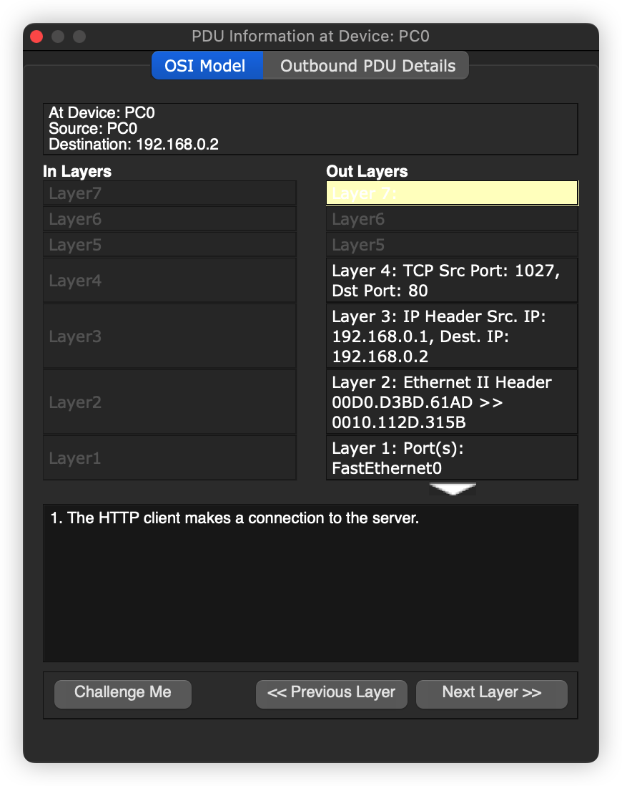

# TCP 连接与断开

## 引言

 TCP 通信是目前计算机网络中主要的通信方式，熟悉TCP 相关的知识是一名合格的计算机人员必备的知识体系，今天就来仿真一下

## 网络拓扑

## 连接

打开仿真模式，打开PC 上的浏览器，输入服务器的地址。

服务端收到请求后，发送一个回应报文。

对应的序列号和确认号都发生变化

之后，客户端就会收到服务器发来的应答报文，客户端浏览器响应

下面就是要关闭了，这个时候客户端要发送一个关闭 TCP 关闭的报文

