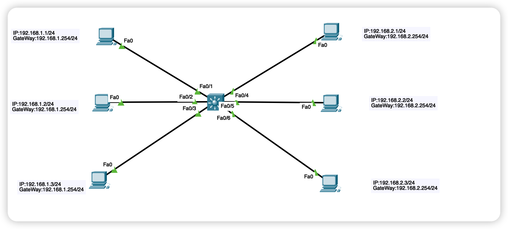
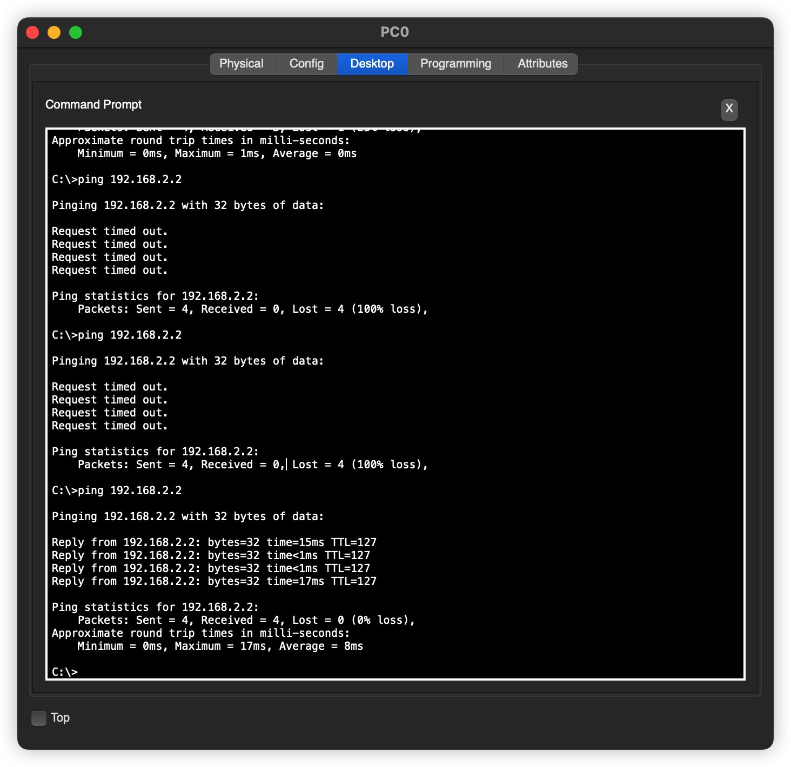

# VLAN 之间的通信-使用三层交换机

## 引言

上文介绍了使用单臂路由来实现在不同主机之间的，但是单臂路由也存在一个很严重的问题，就是，路由器的压力过大，或者说，路由器称为整个通信的核心，所有数据都是在路由器哪里进行交互的。所以，我们可以使用三层交换机来实现VLAN 之间的通信，之所以叫三层交换机，是因为这种类型的交换机添加了路由功能，而路由功能是网络层设备实现的，网络层处于第三层，所以，三层交换机由此而来。

## 网络拓扑

> 和上边的基本一致，主要是布局进行了更换。



## 配置

主要设计中间这个三层交换机的配置

### VLAN的配置

这个不用多说，参考上文

### 配置和开启交换机的路由功能

这是比较核心的功能

这一块没有图形界面，要使用命令行进行操作啦

```bash
Switch(config)#int vlan10
Switch(config-if)#ip address 192.168.1.254 255.255.255.0
Switch(config-if)#
```


同理，对于 vlan20 也是类似的


```bash
Switch(config)#int vlan20
Switch(config-if)#ip address 192.168.2.254 255.255.255.0
Switch(config-if)#
```

如果对应端口没有开的话，要使用 `no shutdown` 开启对应的端口


**开启路由功能**

以上我们仅仅是配置了对应的路由，其实路由功能是没有开启的

```bash
Switch(config-if)#interface vlan10
Switch(config-if)#ip routing
Switch(config)#
```

## 发送数据

经过以上配置，我们发送数据



----

关于 `VLAN` 之间通信的三种方式我们就说完了，完结撒花


