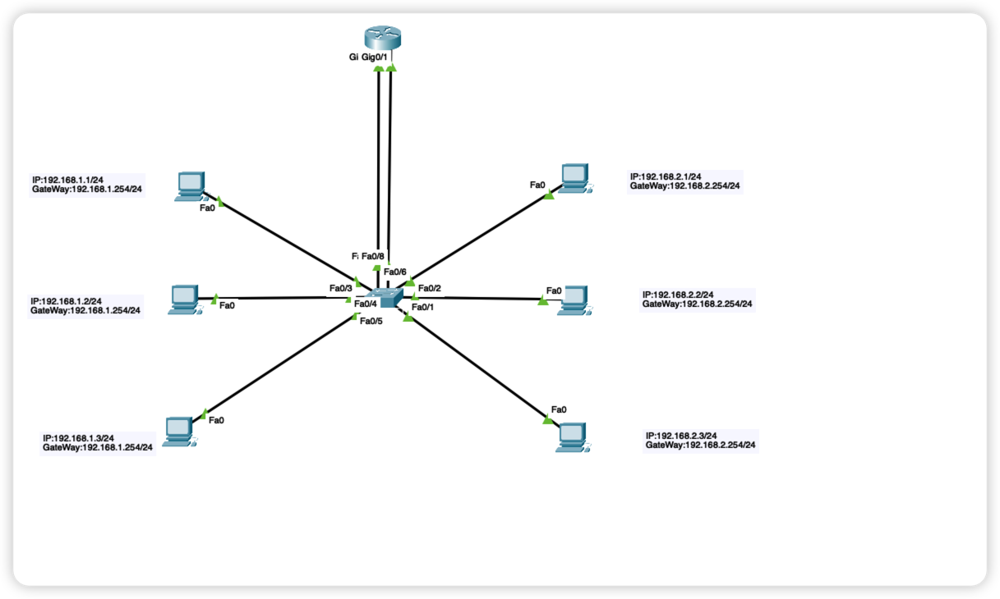
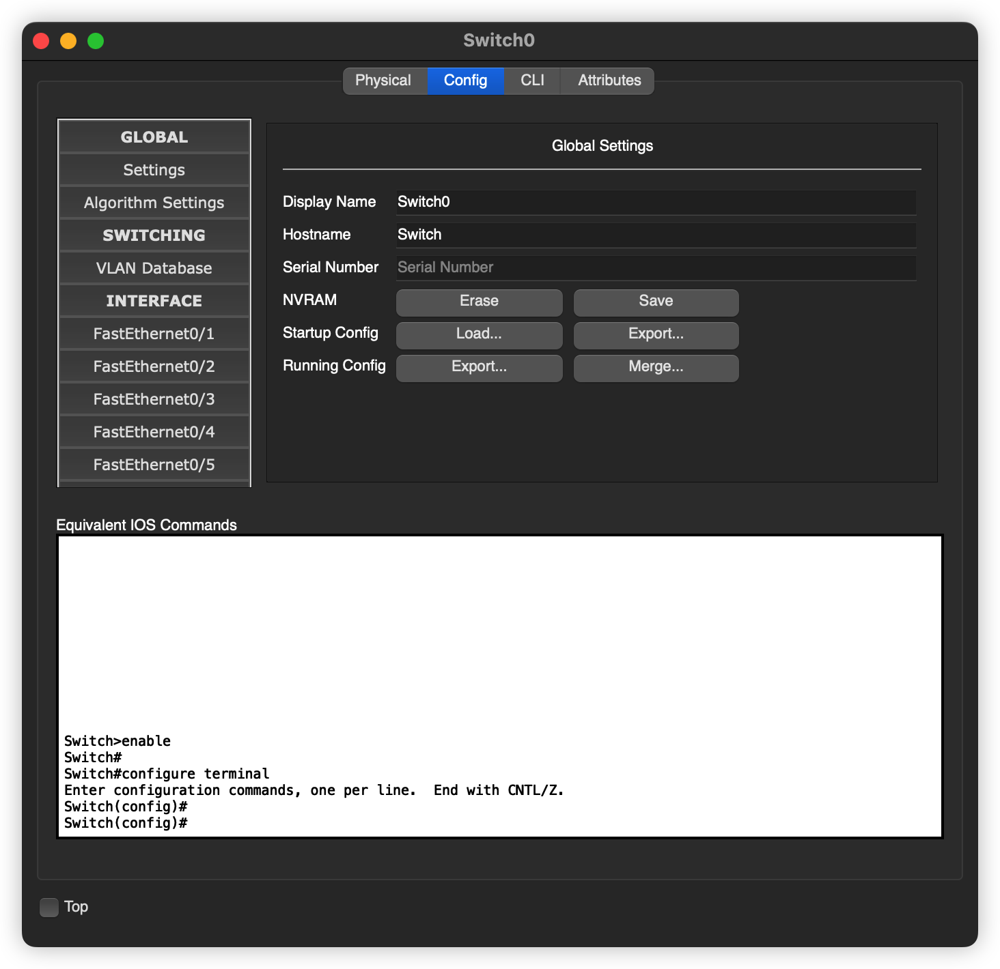
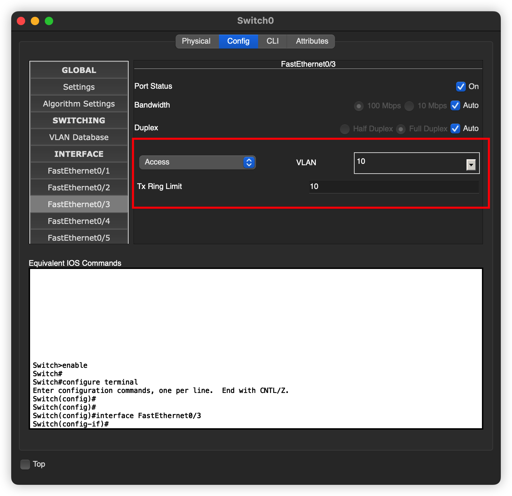
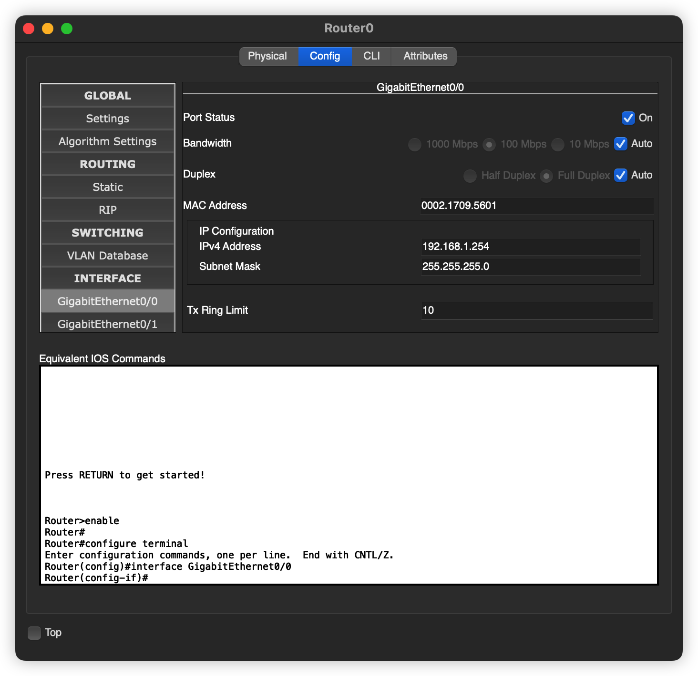
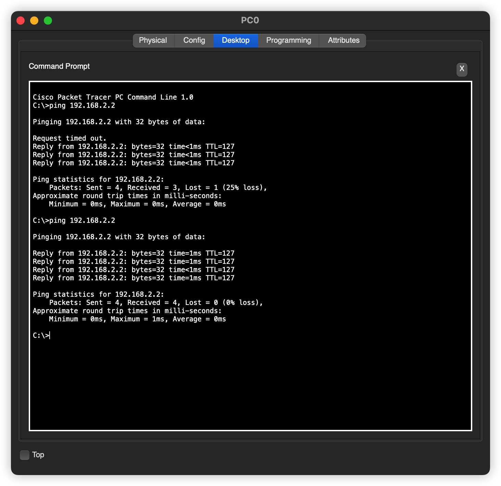

# VLAN 间通信-多臂路由

## 引言

使用 vlan 的确可以隔离不同的网络，但是也造成了一个比较严重的问题，那就是，如果不同主机之间需要通信的话，那么该怎么办？

## 网络拓扑

其实原理就是，利用路由器的来实现不同网络之间的通信，本来 vlan 就好像是两个不同的网络，那么就使用路由器进行不同网络之间的通信的就好了

## VLAN 配置

六台主机应该分别置于不同的 vlan 之下。

左边三台主机划归到 交换机的 vlan10 ，右边的三台主机划归到交换机的 vlan20

交换机vlan如下

配置对应的端口，仅仅演示其中一个端口的配置，其他的不再一一演示

默认为 Access 模式，也不同更改，只需修改对应的端口即可

**路由器的配置** 

路由器的两个接口分别划分到两个不同的 vlan 中，如 接口 `g0/0` 划分到 和左边主机相同的 `vlan` 中也就是 `vlan10`.

同时，路由器的这个端口的 IP 也要配置一下，因为这个端口是作为所在 `vlan` 的默认网关来使用的

**主机IP配置**

各个主机配置对应的ip地址和默认网关

##  发送数据

任意一台主机，对另外一个。`vlan` 中的主机发送 ·`ICMP` 报文

是可以通的，大功告成

