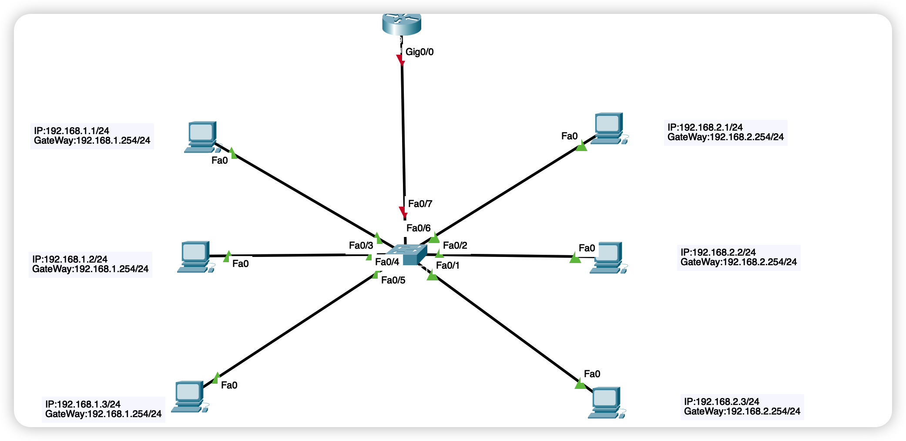
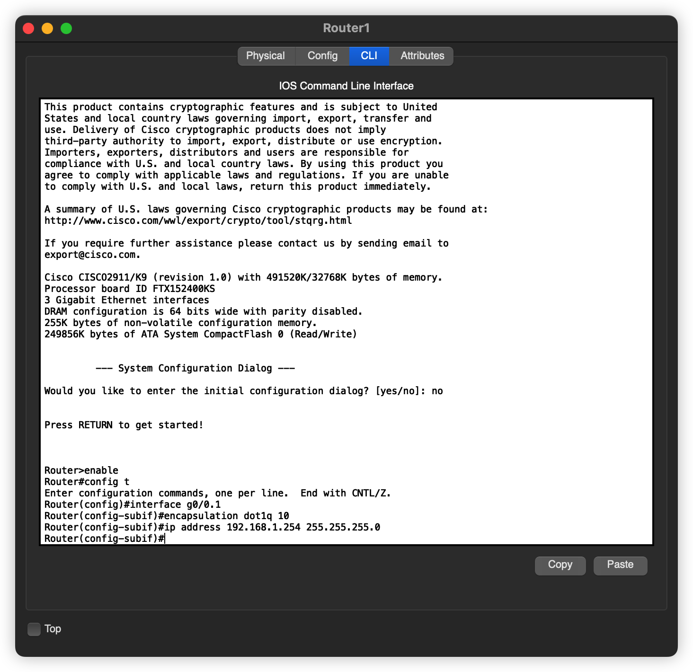
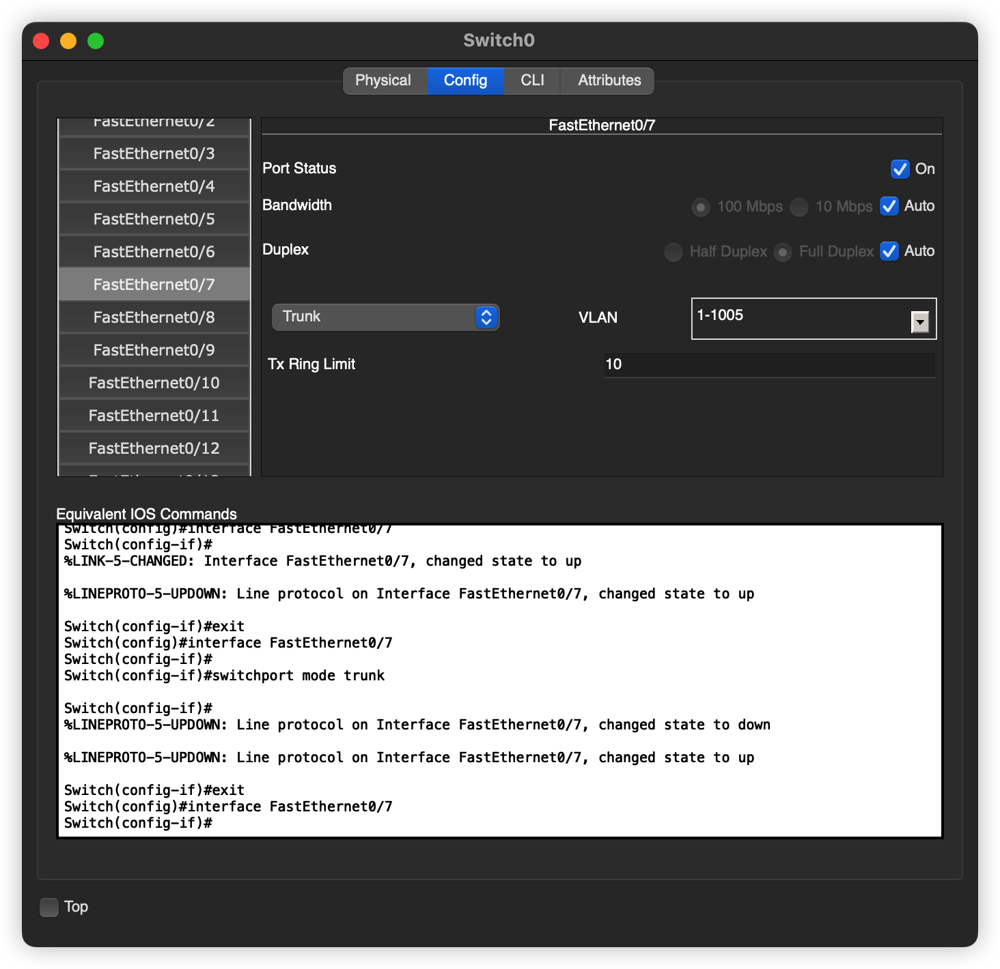
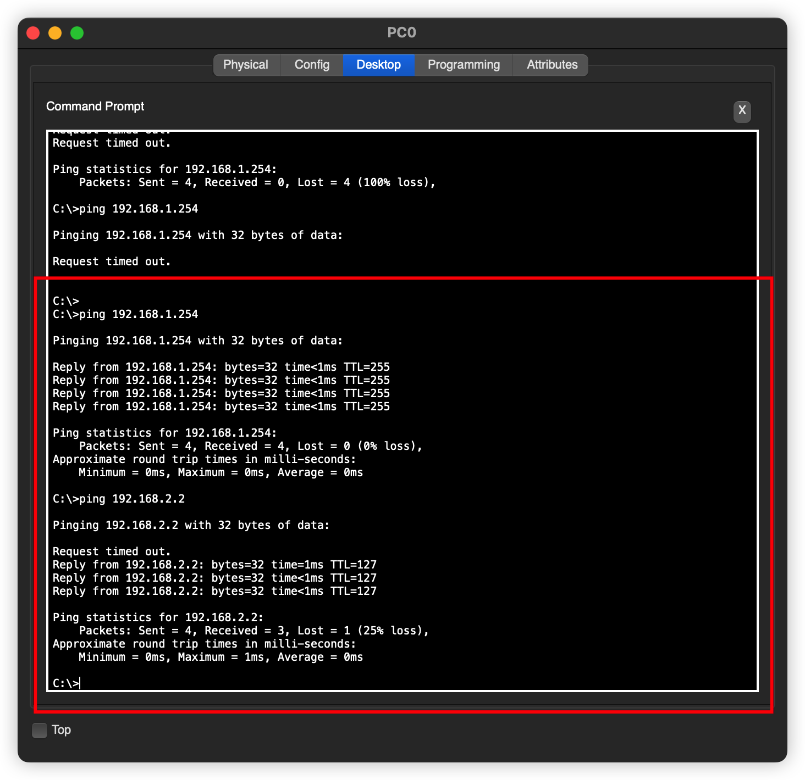

# VLAN 间通信-单臂路由

## 引言

VLAN 之间的通信，上文讲述了使用多臂路由的通信方式，是比较好理解的方式，但是呢？加入我们有好多个 vlan 存在，那岂不是要配置多个路由器接口了。

所以，单臂路由就出现了，具体原理其实有点复杂的。

## 网络拓扑

> 和上一节几乎一样的，就是路由器这里不太一样罢了



## 配置

关于 交换机VLAN 以及各个主机的配置我们就不说了。可以参考上文，主要说一下路由器的配置



```bash
Router>enable
Router#config t
Enter configuration commands, one per line.  End with CNTL/Z.
Router(config)#interface g0/0.1
Router(config-subif)#encapsulation dot1q 10
Router(config-subif)#ip address 192.168.1.254 255.255.255.0
Router(config-subif)#
```

要使用命令行了，这里我们接触了一个新的东西，就是接口后面怎么出现小数点了呢？这个其实是子接口的意思。

添加完子接口一之后，再添加子接口二。

```bash
Router>enable
Router#config t
Enter configuration commands, one per line.  End with CNTL/Z.
Router(config)#interface g0/0.2  #注意
Router(config-subif)#encapsulation dot1q 20 #注意
Router(config-subif)#ip address 192.168.2.254 255.255.255.0 #注意
Router(config-subif)#
```

> 其实主要是这几个地方不同


还有一点就是，路由器和交换机上的这个接口要使用 `trunk` 模式，如下图



## 发送数据

还是老规矩，任意一台主机给对面的主机 发消息

