# IP 地址的分类

## 引言

IP地址是干嘛的呢，就是表示一个网络的，在早期的 `IPv4` 协议中， IP 地址是被分为了好几类的。下面就来演示一个不同类的IP 地址之间的网络通信

## 网络拓扑

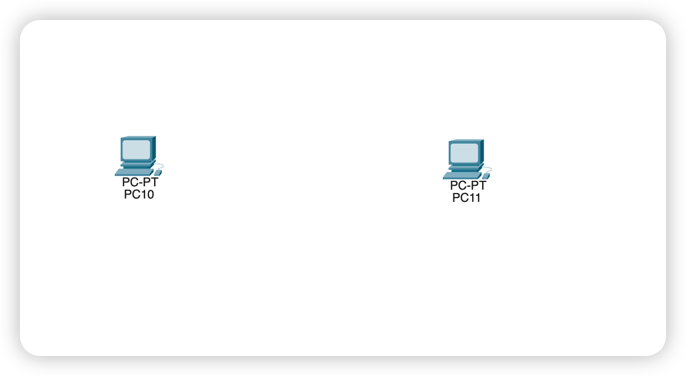

## 同类IP地址直连通信

设置两台 PC 的IP 地址为 同一类，并且在同一个网络下

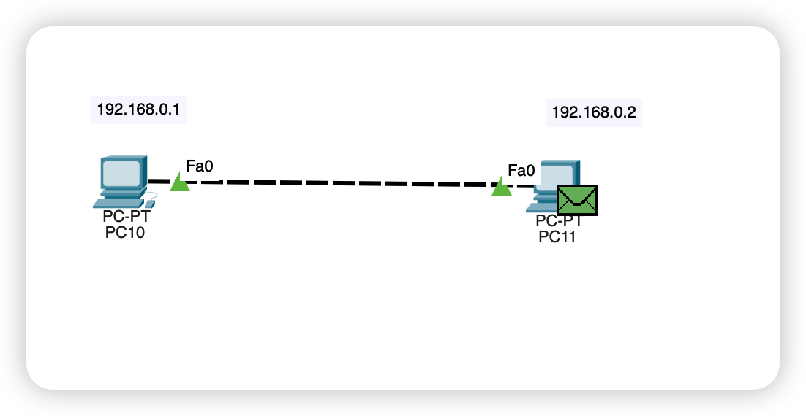

设置好连线之后，我们直接在一台PC 中执行一下 Ping

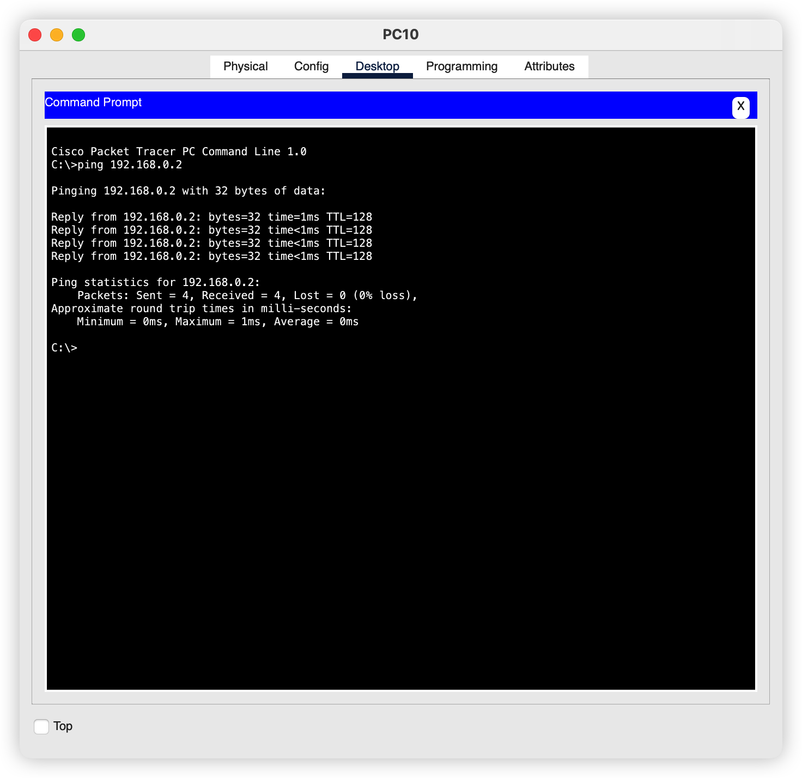

## 不同类IP地址直连通信

修改右边PC 设备的地址为 `172.168.0.1` 和其子网掩码

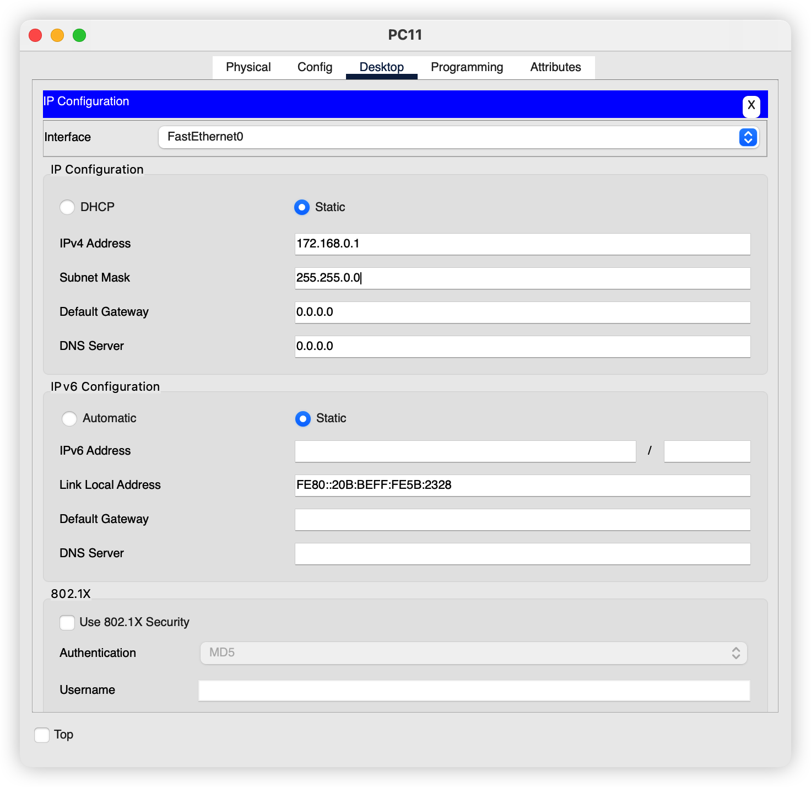

修改完毕之后，我们再次尝试是否可以直接 ping 通

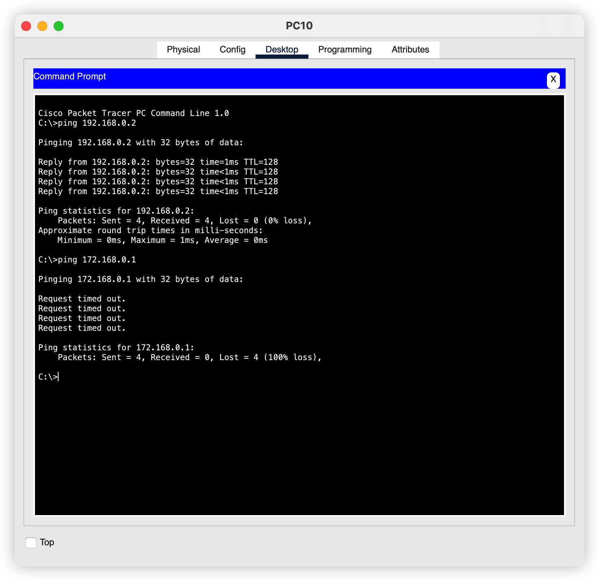

我们看到，是无法想通的

## 使用路由器连接两个不同的网络

>   上面的两台设备通信是直连的，当发送消息的时候，如果目的主机的IP 和发送主机属于同一个网络，那就不需要使用路由器

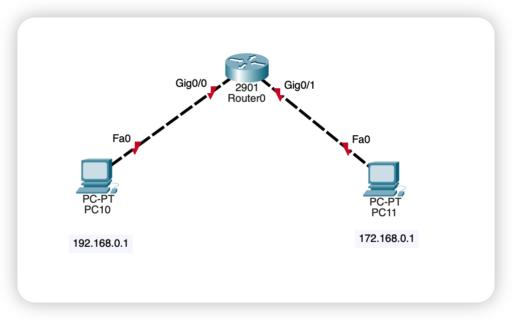

我们不能就这样简单的连接上去，需要配置路由器的各个接口，也就是配置两个接口所处的网络。

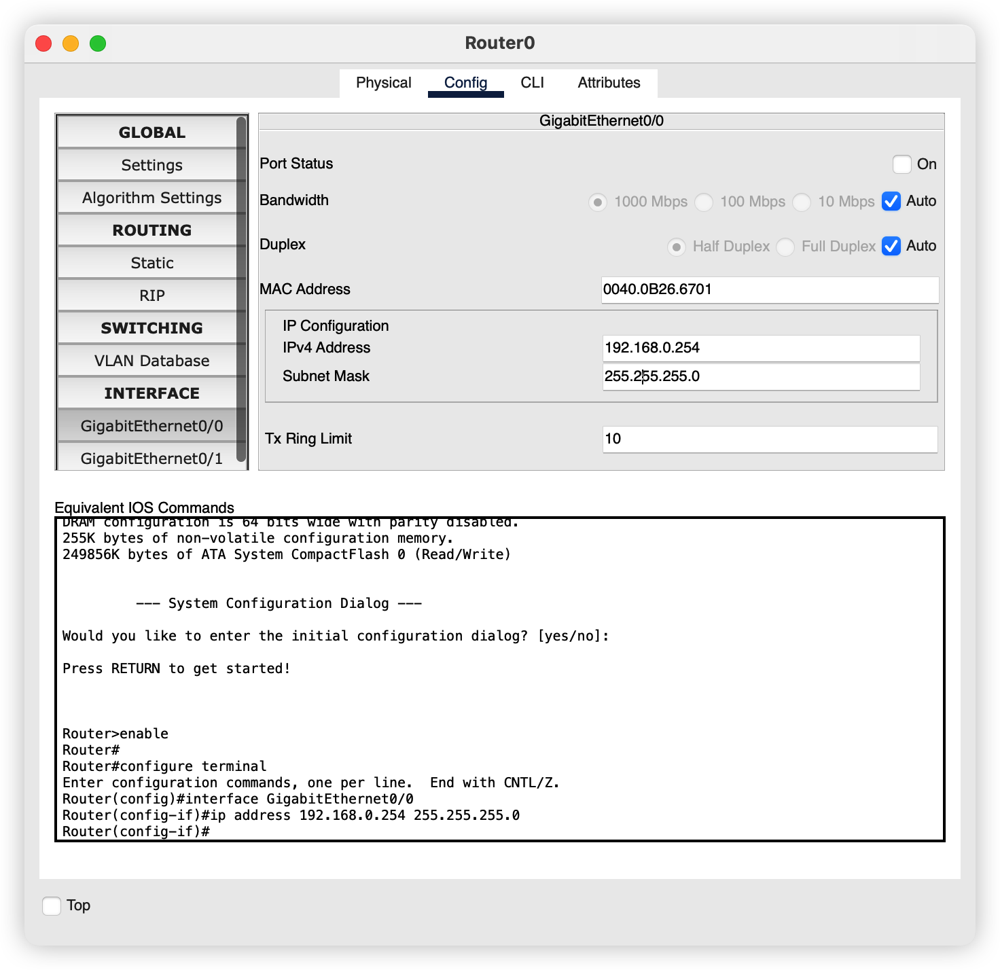

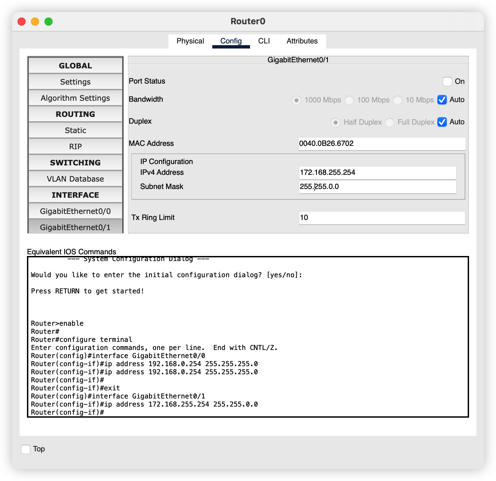

因为路由器的千兆口0连接左边主机，所以应该配置为右边对应的网络，同理，千兆口1连接的是右边的设备，那就要配置右边的网络

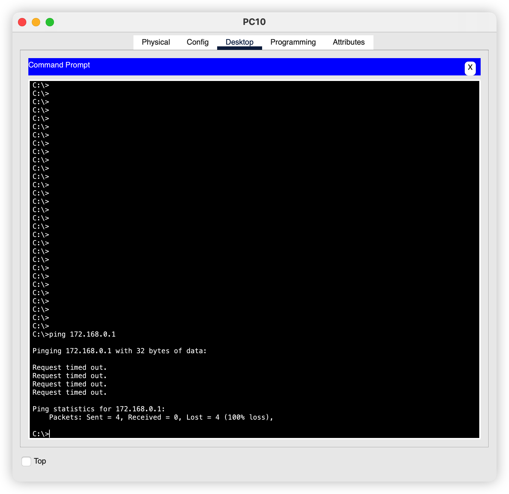

实际上还是不通的，这是为什么呢？

**因为我们没有配置两台设备的默认网关呀** 

这个网关的作用是什么呢？就是目的主机和源主机不在同一个网络下，需要通过这个网关才可以到达目的主机，相当于，在如果这个地方不在国内，那么就要进过海关才可以到达国外（偷渡就先算了）

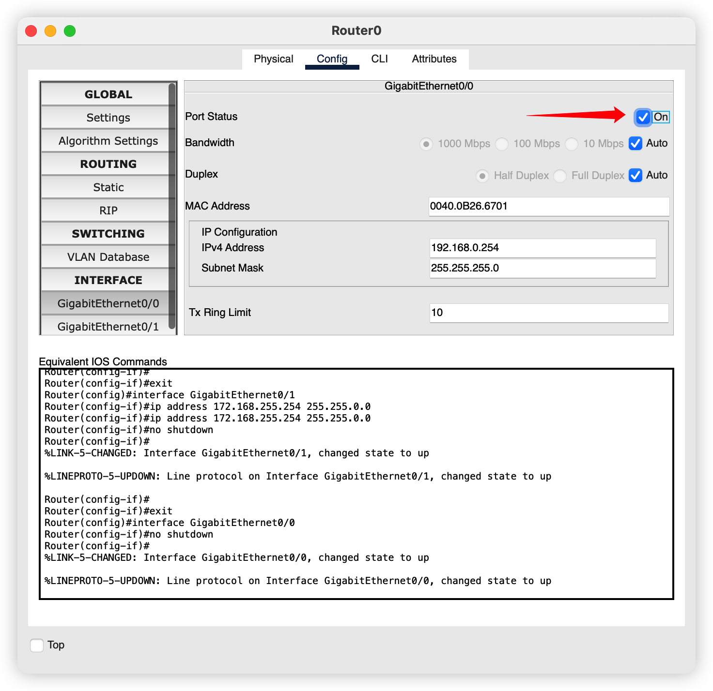

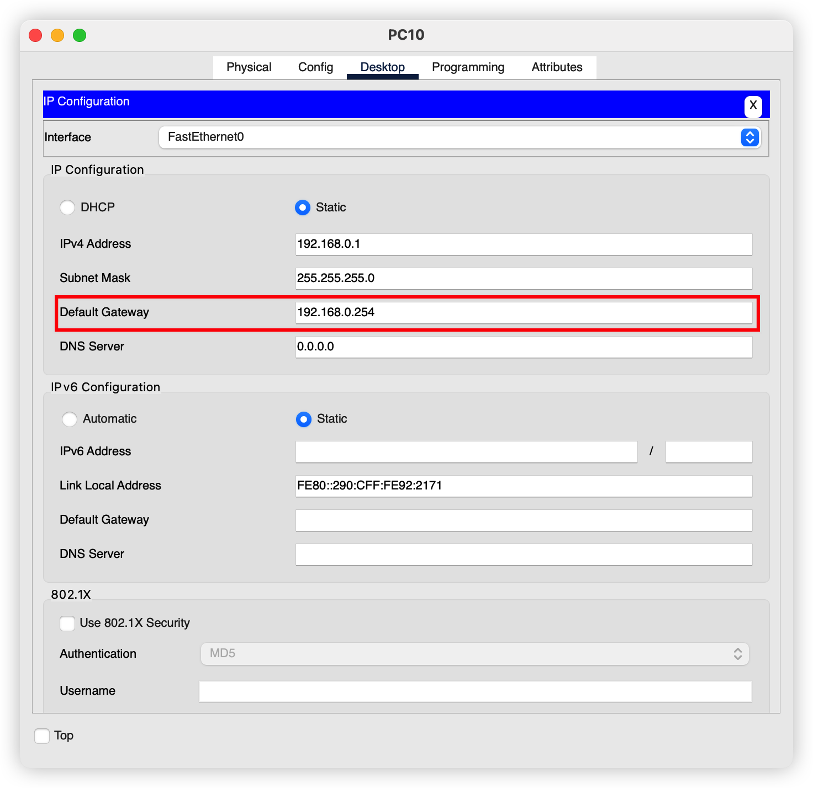

左边同理，之后尝试执行 ping

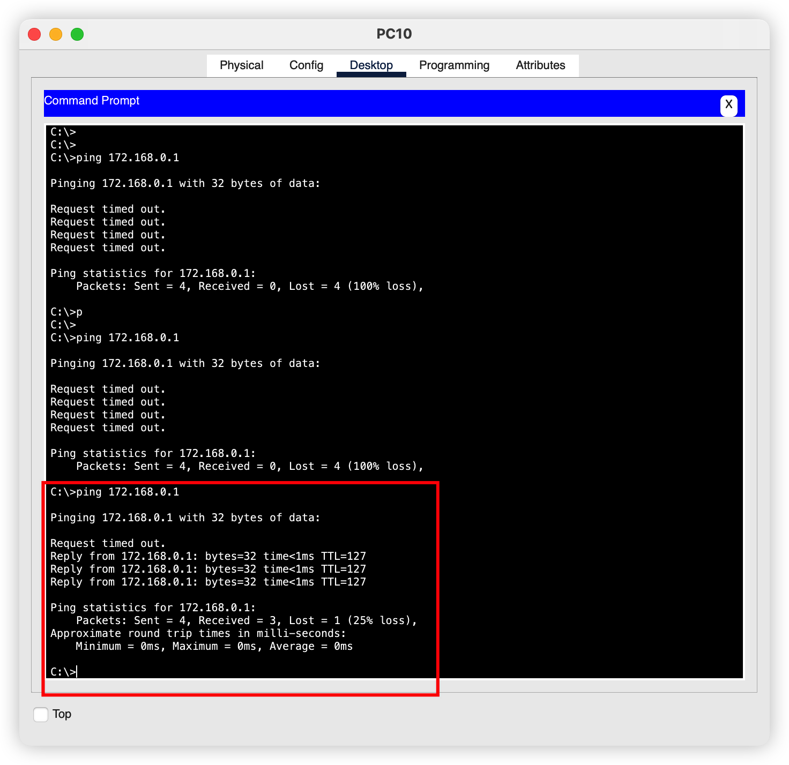

 最后成功ping 通。但是为什么第一个数据包是超时的呢，其实主要是因为第一次通信是的 `ARP` 广播导致的。

