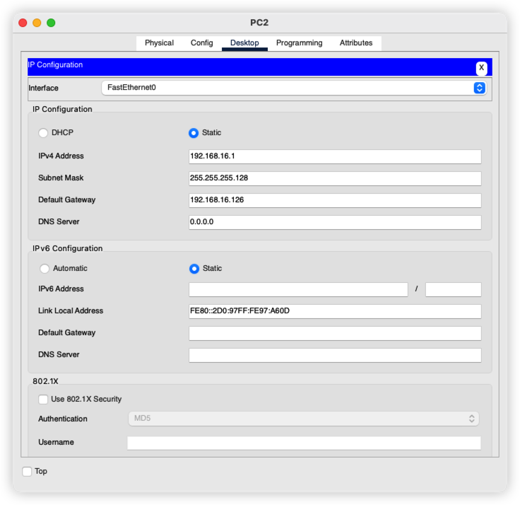

#  构造超网

## 引言

## 网络拓扑


> 图片来自于湖科大教书匠


**经过分析之后，找出各个子网的网络号**


> 图片来自湖科大教书匠

之后给各个主机划分对应的IP 地址和网关


添加默认网关的作用主要是为了不同网络中通信

## 数据联通

对于左边部分的主机，当配置了默认各自对应的 IP 地址和 默认网关之后，就是可以通信的。但是如果想要和右边的主机进行通信，还是不可以的，主要是因为，对于最右边设备直接相连的网络 `192.168.16.196/30` ,  中间的路由器是不知道如果到达这个网络的，**也就是路由器不知道如何到达一个和自己间接相连的网络**


那么对于路由表中的最后两条，实际上是有重叠的路线的，那么就可以使用路由聚合来把这两条路由进行聚合。如何进行聚合呢，其实很简单，就是匹配ip地址的最长前缀啦

##   实验


 这个时候，连线之后应该是这样的，但是我们的线路在物理上是不通的，因为路由器的端口处于关闭状态。

### 打开路由器端口


当然也可以使用命令行模式

```bash
         --- System Configuration Dialog ---

Would you like to enter the initial configuration dialog? [yes/no]: 
% Please answer 'yes' or 'no'.
Would you like to enter the initial configuration dialog? [yes/no]: no
% Please answer 'yes' or 'no'.
Would you like to enter the initial configuration dialog? [yes/no]: no


Press RETURN to get started!


Router>en
Router#config t
Enter configuration commands, one per line.  End with CNTL/Z.
Router(config)#int g0/0
Router(config-if)#no shutdown

Router(config-if)#
%LINK-5-CHANGED: Interface GigabitEthernet0/0, changed state to up

```

把路由器的各个接口打开之后，可以看到各个链路都是通的


### 配置IP地址

接下来我们给各个网络设备配上IP地址，直接参考本文图一



>   不好，reset2 频繁崩溃，导致实验暂时没法做了，那就先这样啦。这个实验主要想说的是

* 1. 不同网络之间的通信需要有一个网关的
  2. 路由器间接相连的网络要配置路由表的，就是告诉路由器，如果要去这个网络需要走那个口出去

  > 举个例子，宁波到杭州是直达的，但是到许昌的话，需要在徐州中转一下，所以我们要知道我们要先知道从宁波到徐州之后，再从徐州转到许昌。要是不知道可以从宁波转徐州再到许昌，那就是不可达拉

  