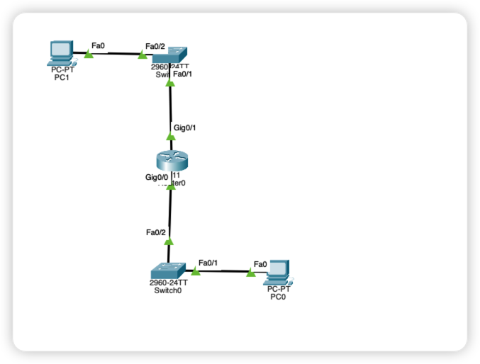

# IP 数据报的转发

## 引言

本来要使用上一节的实验网络拓扑的，但是没办法，思科模拟器崩了，那个网络配起来也比较麻烦，我们那这里就构造一个简单的网络拓扑，仅仅用来演示数据报的发送过程

## 网络拓扑

## 数据交互

### 1. 找到下一个网络设备

 在不知道下一个网络设备的时候，也就是不知道下一跳的MAC 地址的时候，发送方应该要先发送一个 ARP 的广播请求，来确定下一跳的MAC 地址。然后在同一个网络下的设备收到这个ARP 请求之后呢，就会比较，这个ARP 请求是不是找自己或者和自己相连的网络链路的。如果不是就直接丢弃，如果是就发送一个ARP 响应报文。当发送方知道了下一跳的MAC 地址之后，就开始把数据发送到下一跳啦，同时，收到MAC 请求的设备呢，也会根据这个请求更新自己的ARP 表。因为最起码他知道了一台设备的MAC 地址和IP地址

ARP 回应请求就是单播的啦

### 2. 发送数据

当通过ARP协议找到下一跳的广播地址的时候，那就开始真正的数据报的发送了。

## 详解

### 1. PC1 发送ARP请求到交换机

PC1 发送的请求会经过交换机到达同一个网络的所有设备，因为这里，我们的PC1和路由器的。`G0/1`  处于同一个网络之下。同时交换机会通过自学习，来给自己的ARP 表新增一条路径

### 2. 路由器0 发送ARP回应

路由器收到PC1 发来的ARP广播请求之后，发现这个相求就是想要找自己的，也就是说，目的IP所在的网络可以通过自己到达，所以就要回复一个 单播的 ARP 请求回去。同时，交换机再次通过自学习来给自己的ARP 表新增一条记录。假设交换机上有两台设备的话，那么这个设备的正常请求到达交换机后不再需要使用ARP 协议来确定下一跳的 MAC 地址

### 3. PC1 发送数据

经过ARP 的一阵操作，那么现在PC1 已经知道了下一跳的 MAC 地址，那么就会直接把数据发给路由器0.

### 4. 路由器0 发送ARP 请求

路由器0目前还不知道他的下一跳是什么，这个时候就也会发送一个  ARP 请求，

### 5. PC0 收到ARP 请求并回复

顺利的话PC0将会收到这个ARP广播请求，并且发现，发送这个 ARP 请求就是要找自己的，那就发送回应

### 6. 路由器0收到PC0ARP回应

路由器收到之后，就开始发送正式的数据啦。

### 7. PC0 收到数据

顺利的话，PC0这个时候就已经收到数据啦

