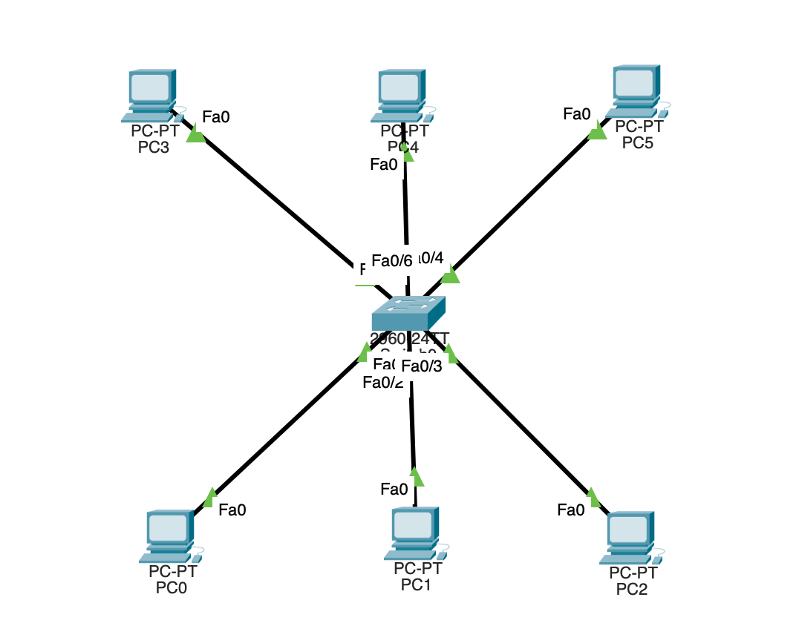

# 虚拟局域网

## 引言
VLAN 也就是虚拟局域网，是可以将局域网内的设别逻辑地而不是物理地划分为一个一个的网段从而实现虚拟工作组的技术

## 网络拓扑
如下图



> 注意！给六台主机要分配上 `IP` 地址哟

然后使用 `show vlan brief` 来查看交换机当前的 `vlan` 状态


默认情况下，交换机上的这些接口都是接在  `vlan1` 上的

## 配置 `VLAN`

我们把上面的三台主机配置到 `vlan2` 下面的三台主机配置到 `vlan3`.
### VLAN2 配置
我们先采用图形界面的模式


可以看到交换机的 `4 5 6`  接口目前都被划分到了 `VLAN` 中


### VLAN3 配置

我们采用命令行的方式

```bash
Switch> enable
Switch#> config terminal
Switch(config)#> vlan 3
Switch(config)#> name VLAN3
Switch(config)#> interface range f0/1 - 3
Switch(config-if)#>switchport mode access
Switch(config-if)#>switchport access vlan 3

```
然后顺利的话，上面的VLAN3就已经配置好了


## 发送数据包
### 同一个VLAN 下发送数据
> 我们在同一个 VLAN 下从一台设备发送一个广播数据包


交换机会把这个广播报文转发到同一个 vlan 下的所有的端口，所以这个时候，上面的处于同一个 vlan 的设备可以接收到数据包，但是下面的三台设备因为处于不同的vlan 中，交换机不会把数据包转发到对应的端口

同理，如果从下面的三台主机中的一台发送一个广播请求的话，那么就也是类似的效果，数据包只能到达本vlan下，是无法到达上面的  vlan 中的


### vlan 的trunk 模式

看如下的网络拓扑图

同样的，我们左边交换机上面的两台设备划分到 vlan2，下面的两台设备划分到哦vlan 3

并且要把两台交换机相连的接口改为  `trunk` 模式


反复切换实时模式和仿真模式，最后所有的链路都是通的


我们再次发送一个广播请求


