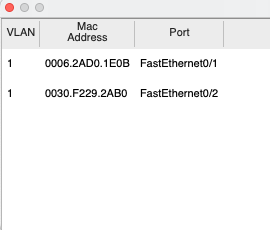
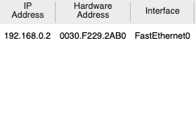
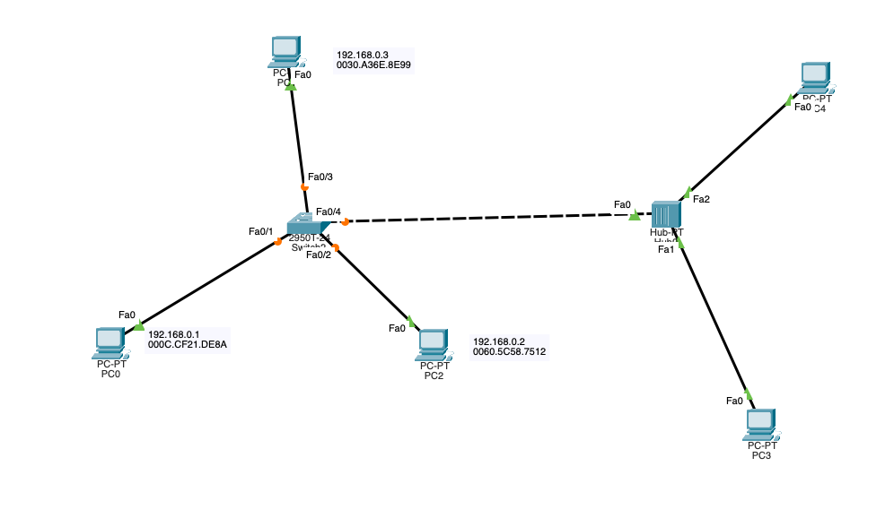
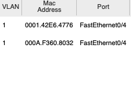

# 交换机的自学习功能

## 一、引言
交换机的自学习应该是网络设备进行通信必不可少的功能，主要就是不需要通过管理员特意的配置，仅仅使用不同设备之间通信时发送的   `ARP` 报文以及回响的 `ARP` 报文来构建自己的内建 `MAC` 地址表的

## 二、网络拓扑
下面给出一个一台交换机连接三台 `PC` 的网络模型。

同时我们也打开显示对应的端口并且手动的给各个设备标记其自身的 `IP` 和 `MAC` 地址

## 三、数据交互

接下来通过不同设备间的通信来展示交换机自学习功能

### 3.1 `PC0` 和 `PC2`之间进行通信 
在此之前，我们先查看一下 交换机的 `MAC` 表

我们发现此时应该是为空的，这个时候我们的网络设备之间没有进行过网络通信

> 采用 仿真模式，发送在两台设备之间发送ICMP 报文

但是此时我们会看到有两个消息报文要发送，其实第一个报文就是设备要发送的 `ARP` 报文，因为该设备不知道目的设备的 `IP` 的`MAC` 地址，所以就要发送一个广播的 `ARP` 请求。

当我们的这个 `ARP` 请求到达交换机是，交换机解析这个 `MAC` 报文，利用报文中的源 `MAC` 地址和进行自身 `MAC` 地址表的学习，同时交换机在不知道其所连接的设备的 `MAC` 地址时，会进行ARP报文的广播。上面的设备收到报文之后，发现不是自己的 MAC 地址，那就直接丢弃了，但是右下角的设备发现这个 `ARP` 报文时找自己的，那就回回应一个 `ARP` 报文。这个时候，交换机利用 `PC2` 发送的报文进行 “自学习”。加上前面的 `PC0` 发送的报文，交换机里面的`MAC表`应该是有两条数据的

同时 `PC2` 的 `ARP` 也发回到 `PC0` 里面。 `PC0` 也就知道了 `PC2` 对应的 `IP` 和 `MAC` 地址

上面的过程完成之后，就可以愉快的在主机之间进行通信啦

### 更加复杂的网络结构

网络拓扑如下

在这里，我们 `PC3` 和 `PC4` 之间进行数据的收发，因为中间使用了集线器，那么势必就会导致数据报的广播，当 `PC3` 给 `PC4` 发送请求的时候，交换机回收到这个报文，进行第一次的自学习，当 `PC4` 给 `PC3` 回应报文的时候，交换也会进行一次自学习。最中结果就是

## 总结

交换机进行自学习的条件很简单，就是收到网口发上来的 `ARP` 报文之后就会进行自学习
同时，自学习的到的 `MAC` 表并不是一成不变的，一段时间之后就会自行失效
