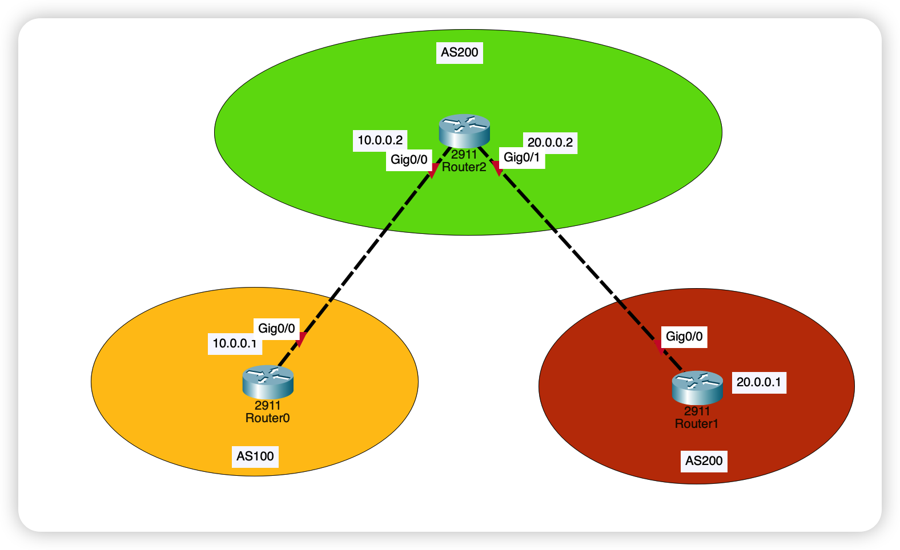
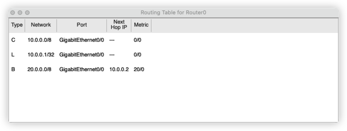
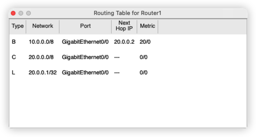

#  边界网关协议 BGP

## 引言

关于BGP 协议，大概了解即可，主要还是用于不相关的路由活着自治系统之间的通信

[边界网关协议_百度百科 (baidu.com)](https://baike.baidu.com/item/边界网关协议/2987527)

## 网络拓扑



## 未使用BGP

在没有使用BGP 协议的情况下，左边的路由器是无法和右边的路由器通信的，因为左边路由器的路由表中是没有右边这台设备的路由的


## 配置 BGP 协议

接下来就开始配置一下 BGP协议吧

```bash
Router>enable
Router#
Router#configure terminal
Router(config)#router bgp 200
Router(config-router)#neighbor 20.0.0.2 remote-as 300
```

 按照上面的命令，分别给处于三个自治系统的路由器配置 BGP 协议

----

但是仅仅配置完成 BGP 协议还是不行的，我们要使用。`network` 命令

比如对于左边的一台路由器

```bash
Router(config)#router bgp 100
Router(config-router)#network 10.0.0.0 mask 255.0.0.0
```


经过以上的步骤之后，我们的网络就通了





