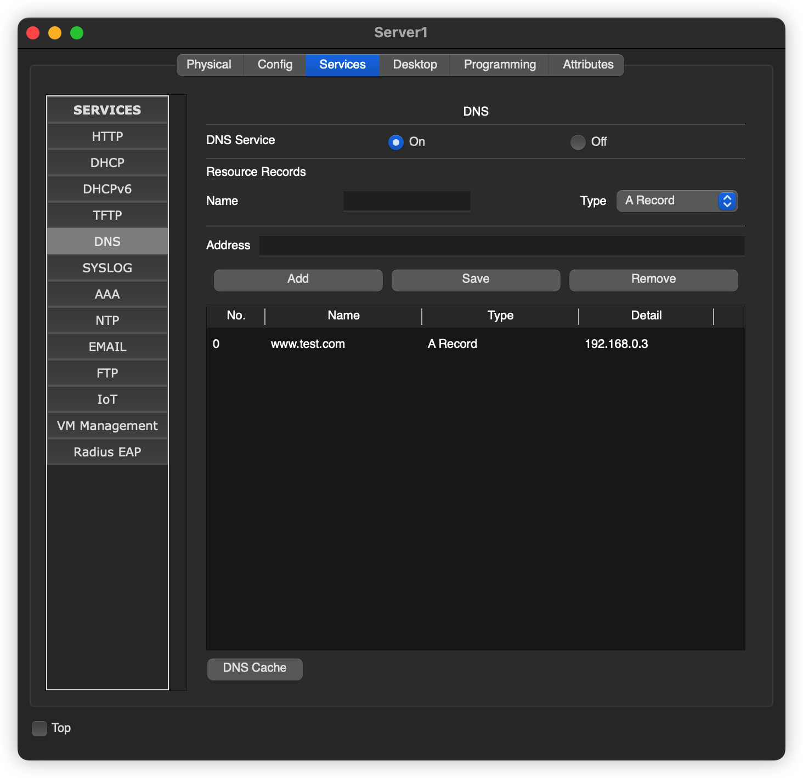

# 运输层端口

## 引言

运输层位于TCP/IP 网络模型中的应用层之下，也就是 TCP 和 UDP 所在的那一层,，本节我们就来实际的演示一下最基本的个人 PC 访问 一个Web 服务器的操作

## 网络拓扑

## 配置相关参数

### PC 

### DNS 相关配置

### Web 服务器配置

----

以上配置就完毕了

## 访问Web服务器

打开主机里面的桌面，第一排最右边的浏览器

----

**PC先向DNS服务器发送请求**

> 之所以也会想服务器发送这个请求是因为交换机的广播作用，如果 我们配置的是一台路由器的话，路由器就不会向 Web 服务发送这个请求了，但是一旦配置了路由器直连的话，DNS 也就失去了作用。

你之后 DNS 服务器会发送一个报文给 PC ，同时因为交换机的自学习功能，这次交换机不会吧数据转发到 Web 服务器啦

**PC解析DNS发送的报文** 

PC 解析DNS 服务器发送的报文之后，就知道了web 服务器的IP地址啦。

然后向Web 服务器对应的 IP 地址发送请求

**Web服务器响应** 

好的，本节到此为止

