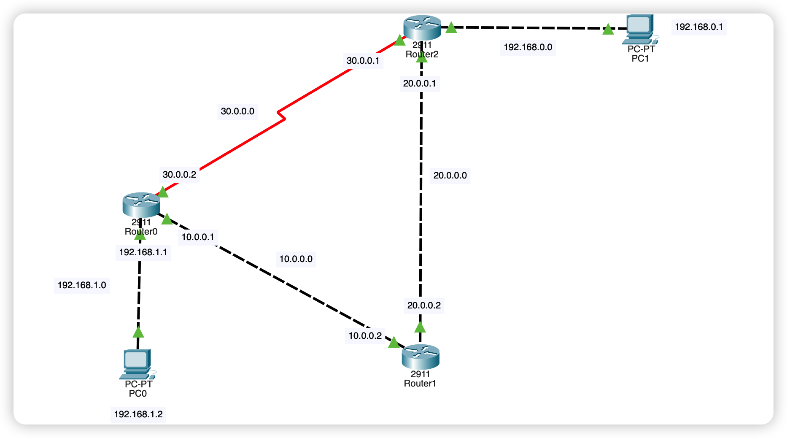
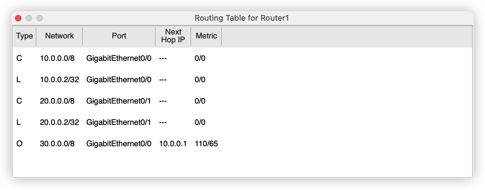
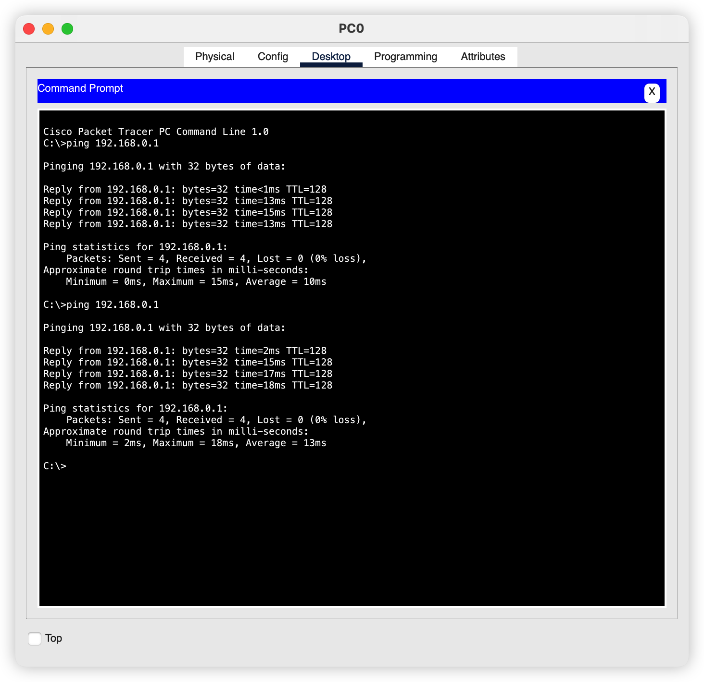

# 开放最短路径优先 OSPF 

## 引言

这个 OSPF 协议其实是比较复杂的，我们了解大概的就好了，这里给个链接

[OSPF路由协议 - 知乎 (zhihu.com)](https://zhuanlan.zhihu.com/p/63621910)

## 网络拓扑

> 和上一节一样，就是要把 RIP 协议换成 OSPF 协议就好了



## 配置 OSPF 协议

这个 OSPF 协议的配置稍微麻烦一点啦，必须要使用命令行来操作啦

打开路由器的 `CLI` 界面

```bash
Router>enable
Router#config terminal
Enter configuration commands, one per line.  End with CNTL/Z.
Router(config)#router ospf 100
Router(config-router)#network 20.0.0.0 0.255.255.255 area 0
Router(config-router)#network 10.0.0.0 0.255.255.255 area 0
Router(config-router)#
```

依次对每一个交换机执行对应的命令




> 图中 O 开头的就是 使用 OSPF 协议计算出来的路由信息

## 发送数据



## 总结

那么OSPF 和 RIP 有什么不同呢，主要不同就是RIP 是简单的计算路由器的跳数来计算路径的，也就是RIP 协议认为中间经过的路由器的跳数越少这条线路就越优越。但是 OSPF 协议就不是这样的，是通过计算代价来选择线路的，这个代价怎么计算的呢，比较复杂了，可以自己研究一下 OSPF 协议

